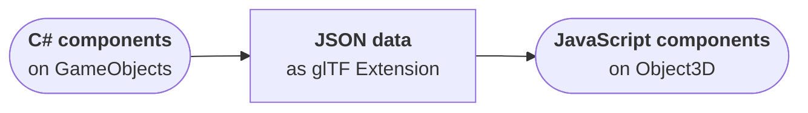
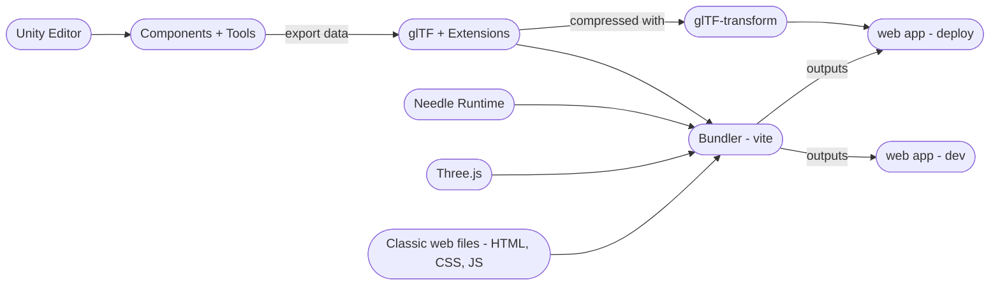

<!-- scripting -->

```mermaid
flowchart LR
  Editor([<b>C# components</b><br/>on GameObjects]) --> gltf[<b>JSON data</b><br/>as glTF Extension] --> Runtime([<b>JavaScript components</b><br/>on Object3D])
  class Editor,gltf,Runtime bg;
``` 

<!-- technical overview -->

```mermaid
flowchart LR
    Editor([Unity Editor]) --> EditorExt([Components + Tools])
    EditorExt -- export data --> glTF([glTF + Extensions])
    glTF --> Bundler([Bundler - vite])
    Runtime([Needle Runtime]) --> Bundler
    Three([Three.js]) --> Bundler
    YourWebsite([Classic web files - HTML, CSS, JS]) --> Bundler
    Bundler -- outputs --> DevPage([web app - dev])
    Bundler -- outputs --> DeploymentPage([web app - deploy])
    glTF -- compressed with --> gltfTransform([glTF-transform]) --> DeploymentPage
    class EditorExt,glTF,Runtime ndl;
    class Editor,Three,Bundler,Page,gltfTransform,DeploymentPage,DevPage,YourWebsite ext;
```
