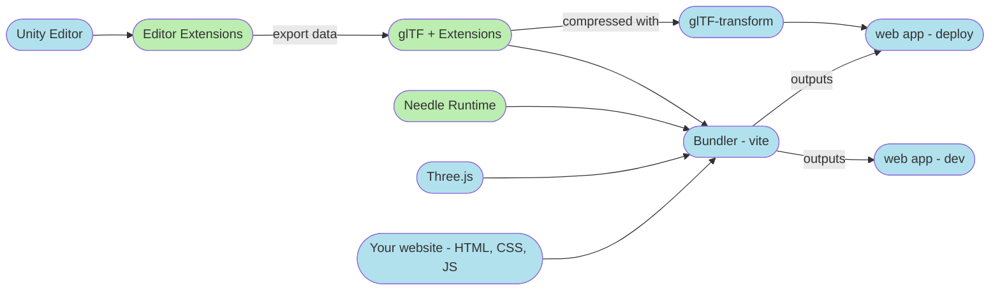

# Documentation Backlog
This section contains pieces of information that are important, but need to be sorted into their correct categories.

## Recommended Unity configuration

- Unity 2020.3.8f1+ or 2022.1+
- Render Pipeline: Universal  
- Color Space: Linear  
- Non-Directional Lightmaps  
- Lightmap Encoding: Normal Quality  

## Supported Unity configurations

- Unity 2020.3+ | Unity 2021.3+ | Unity 2022.1+  
- Render Pipeline: Universal | Built-In1  
- Color Space: Linear  

1: no custom shader support

## Recommended Lightmap Settings

- Lightmap Encoding: Normal Quality (adjust in `Project Settings > Player`)
- Progressive GPU  
- Non-Directional Lightmaps  
- Max Lightmap Size 2k  
- Compress Lightmaps OFF (otherwise will be compressed again at export time)  

## Recommended scene complexity

> The scene complexity here is recommended to ensure good performance across a range of web-capable devices and bandwidths.  
There's no technical limitation to this beyond the capabilities of your device.  

- Max. 20 MB export size uncompressed (usually ends up ~5-8 MB compressed)  
- Max. 500k vertices (less if you target mobile VR as well)  
- Max. 4 2k lightmaps  

You can split up scenes into multiple glTF files with some limitations, and then load those on demand (only when needed). This keeps loading performance fast and file size small.

## Source Control

Generated Projects can either be added to source control or kept dynamic. Adding them to source control unlocks being able to adjust HTML, CSS, etc very flexible.  
To generate dynamic projects, change their path to `../Library/MyScene`. They will be regenerated if needed.

# How it works

Needle Engine roughly consists of three parts:
- a number of _editor extensions_ that allow you to set up scenes for Needle Engine from e.g. the Unity Editor.
- an _exporter_ that turns scene and component data into glTF
- a _web runtime_ that loads and runs the produced glTF files and their extensions.

The editor extensions currently support the Unity Editor, with some promising experiments for Blender on the horizon (but no ETA).  
The web runtime uses three.js for rendering, adds a component system on top of the three scene graph and hooks up extension loaders for our custom glTF extensions.  

Effectively, this turns the Unity Editor into a full member of a regular web development toolchain – "just" one more piece that gets added to the regular HTML, JavaScript, CSS and bundling workflow.  

# Goals and Non-Goals

## Goals
- Fast iteration and rapid deployment.
- Same ease of working on 3D web projects as on 2D web projects
- Improve collaboration between developers and artists
- Responsive web extends beyond screens – AR and VR should be built in, not afterthoughts.
- Contributing back to open-source projects
- Open discussion regarding 3D and web standards
- Ability to bring and take your data in open formats
- Ability to choose what web framework you use, not locked into a particular one
- Common usecases work without or with limited coding experience
- 
## Non-Goals
- It's not a goal to have 100% coverage of all combinations of Editor versions, feature sets, render pipelines.
- It's not a goal to provide a no-code environment.

*Please follow the instructions in the Authentication section if this is your first time accessing packages by needle on this machine.*

# Licensing Setup

## Authentication  

Make sure you have a Needle Engine and Exporter license, otherwise the following steps will fail (you'll not be able to get authenticated package access).  

*Needs to be setup once per machine.*  

1) Clone this repository and open ``starter/Authenticate`` with Unity 2020.3.x
2) Open [https://packages.needle.tools ⇡](https://packages.needle.tools) in your browser and login (top right corner) with your github account. 
3) Return to [packages.needle.tools ⇡](https://packages.needle.tools) and click the ``i`` icon in the top right corner opening the ``Registry Info`` window.
4) Copy the line containing ``_authToken`` (see the video below)  
   <video src="https://user-images.githubusercontent.com/5083203/166433857-a0c9e29f-9413-4e10-a1a1-2029e3d3ab06.mp4" autoplay></video>
6) Focus Unity - a notification window should open that the information has been added successfully from your clipboard.
7) Click save and close Unity. You should now have access rights to the needle package registry.
