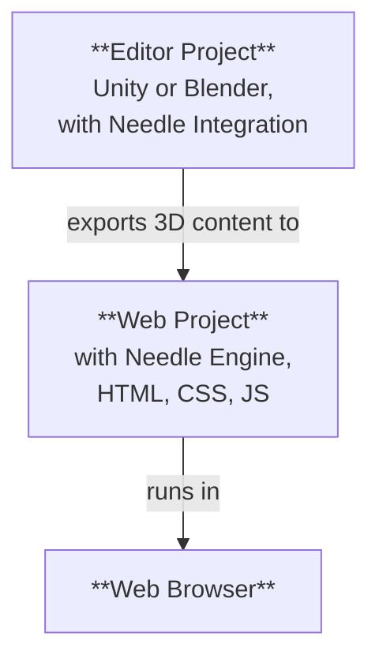

# Structure of a Needle Engine project

Needle Engine integrates deeply with 3D softwares like Unity and Blender, and at the same time has the full flexibility of modern web development. For this reason, a project made with Needle usually consists of **two parts**: an **Editor Project** and a **Web Project**. We'll often refer to the Editor Project as "Unity Project" or "Blender Project", depending on which editor you use.



## Editor project and web project

The **Editor Project** is where you create your 3D scenes, add components to objects, add materials and lights, set up the environment, animate and so on. You can use all the powerful tools of your 3D software to create the content that will be exported to the web. If you're working with Unity or Blender, you'll want to install the [Needle Engine for Unity](/docs/unity/) package or the [Needle Engine for Blender](/docs/blender/) add-on.

The **Web Project** is where your web app comes together. It contains the exported 3D assets, the scripts that control the behavior of your app, and the HTML and CSS that define the look and feel. The web project is powered by Needle Engine, which is responsible for loading and displaying your 3D content, managing script components and their lifecycle, and utilizing the web platform's capabilities like WebXR, audio, networking, and more.

## Creating a web project

By default, the web project is **created and managed by Needle**, which means that you don't have to worry about how to set up the package, add dependencies, or building – you can focus on creating your content. The integrations for Unity and Blender make it easy to create a web project right from your editor.

:::: tabs
@tab Unity

Find the Needle Engine component in your scene or add it, then click on <kbd>Generate Project</kbd>. This will create a new web project in the folder you specify.


@tab Blender

Find the Scene panel and Needle Engine section, then click on <kbd>Generate Web Project</kbd>. This will create a new web project in the folder you specify.


@tab From the command line

Open a terminal and run the command `npx create needle` to create a new Needle Engine web project. The command will prompt you for the project name, framework, and other settings. You can also specify the folder where the project should be created.

:::tip Install Node.js first
Make sure you have [Node.js](https://nodejs.org/) installed on your system.
You can check if you have it installed by running `node -v` in your terminal.
If you don't have it installed, download and install it from the [Node.js website](https://nodejs.org/).
:::

```bash
% npm create needle

> create-needle

create-needle version 0.1.1-alpha

┌  Welcome to Needle Engine! 🌵
│
◇  Where should we create your project?
│  my-project
│
◇  What framework do you want to use?
│  HTML, CSS, JavaScript with Vite
│
└  Your project is ready!

Next steps:
  1: cd my-project
  2: npm install (or npm i)
  3: npm start (or npm run dev)
  4: Connect an integration (Unity, Blender, ...)
```

::::

::: tip Bring your own project
Needle Engine is very flexible. You can modify the existing web project or use your own. That allows you to integrate into existing projects, use a different build system, or use a different framework like React, Vue, or Angular.
::: 

## Opening the web project in a code editor

We recommend [Visual Studio Code](https://code.visualstudio.com/) as code editor, because it has great support for web development in general, and TypeScript in particular. When you generate a web project, we automatically create a `.code-workspace` file that you can open in Visual Studio Code. This file contains the configuration for the workspace, including the folders to include and the settings for the editor.

::: tabs
@tab Unity

Click on <kbd>Open Code Editor</kbd> on the **Needle Engine** component. This will open the web project in Visual Studio Code, with all the folders and files included.


@tab Blender

Click on <kbd>Open Code Editor</kbd> on the **Scene > Needle Engine** panel. This will open the web project in Visual Studio Code, with all the folders and files included.


@tab Find it in Explorer or Finder

Double-click the `.code-workspace` file. This will open the web project in Visual Studio Code, with all the folders and files included. You can of course also open the web project folder in other code editors if you prefer.


:::

## Understanding files and folders in the web project

The default web project is based on a standard structure that follows modern web development practices. It uses the excellent [Vite](https://vitejs.dev/) as development environment, bundler, and build tool. The following sections describe the structure of a typical Needle Engine web project. 


:::tip The places you'll most commonly interact with are `src/scripts/` and `build/`.
Add your own components to `src/scripts/`. You write them in TypeScript.

When building your web project, either by clicking "Build" in the editor or running `npm run build`, the final files are placed in the `dist/` folder. This is the folder you can upload to a web server to host your web app.
:::

:::: file-tree name="Web Project File"

::: file index.html
The start page of your web project. You can add additional HTML, stylesheets or script imports here. Custom Needle components should be put into the `src/scripts/` folder.  
<br>
You also find the `<needle-engine>` web component here, which displays your 3D content. You can modify its attributes to change the environment, loading style, contact shadows, and more. See the [Web Component Attributes Reference](/docs/reference/needle-engine-attributes) for a list of available attributes.

:::

::: file assets/
The asset folder contains 3D and other files exported by the integration. This includes  `.glb` files, audio or video files. The folder is managed by the integration, so if you want to add additional assets, put them into `include/`instead.
:::

::: file assets/MyScene.glb
The exported 3D scene from Unity or Blender is automatically placed here. The filename depends on how your Unity or Blender scene is named. There may be more files in this folder, depending on how your project is set up. For example, if you have multiple scenes, or use audio or video files, they will be here as well.
:::

::: file src/
The source code of your web project. This is where you write your scripts, styles, and other code that makes up your web app. Needle places some generated files here, and you can add your own code as well.
:::

::: file src/main.ts
This script is included from `index.html` and runs at startup. It imports `@needle-tools/engine` and loads the main engine code. You can add plugins for Needle Engine here.
:::

::: file src/scripts/
Add your custom scripts in this folder. Our [component compiler](/docs/explanation/core-concepts/component-compiler) will automatically generate stub components for Unity and Blender from them.
:::

::: file src/scripts/MyComponent.ts
An example of a custom script that will be compiled into a Unity C# component or Blender panel. You can add your own scripts here, and they will be automatically picked up by the component compiler.
:::

::: file src/styles/
The styles folder contains the stylesheets for your web project. You can add additional stylesheets here and import them in `index.html`.
:::

::: file src/styles/main.css
The default stylesheet for your web project. Add your own styles here, or create additional stylesheets in the `src/styles/` folder. You can import them in `index.html`.
:::

::: file src/generated/
The files in this folder are **generated and managed** by the Needle integration. Do not edit them manually – they will be overwritten on export.
:::

::: file src/generated/gen.js
**This file is generated**. It tells the `<needle-engine>` web component which file to load initially.
:::

::: file src/generated/meta.json
**This file is generated**. It contains metadata about the project, such as the name of the main scene, the version of Needle Engine used, and other information.
:::

::: file src/generated/register_types.ts
**This file is generated**. It automatically imports custom components that your project uses, both from your code and from dependency packages.
:::

::: file include/
If you have custom assets that you want to load at runtime, add them to the include folder. On build this folder will be copied to the output folder.
:::

::: file dist/
The output folder where the built web project is placed. This is where the final web app is generated. It contains the bundled and minified files that are ready to be published to a server.
:::

::: file needle.config.json
The [Needle config](/docs/reference/needle-config-json). Needle integrations and build tools use this file. It contains information on where to export assets to, and where the build folder is.
:::

::: file vite.config.js
The [vite config](https://vitejs.dev/config/). Settings for building the distribution and hosting the development server are made here. Usually, you don't need to change this file, but you can add additional plugins or modify the build process if needed.
:::

::: file package.json
Project configuration containing name, version, dependencies and development scripts. You can add additional npm packages as dependencies here.
:::

::: file tsconfig.json
This is the Typescript compiler configuration. It tells TypeScript that we're using modern scripting features.
:::

::: file .gitignore
This file specifies which files and folders should be ignored by the git version control system. The default web project excludes the `/dist`, `node_modules`, and `.vite` folders. If you're using some other version control system than git, you should exclude these folders.
::: 

::::


Our exporter can be used with other project structures as well. We chose Vite as bundler because of its speed and flexibility. Feel free to set up your own project structure, or use a different bundler like Webpack. Needle Engine is designed to be flexible and can usually be adapted to your needs. [Learn more about bundling and other frameworks](/docs/how-to-guides/web-integration/).

## Extending the web project

The web project uses an industry-standard structure:

- [Node.js](https://nodejs.org/) and npm for package management and build scripts
- [TypeScript](https://www.typescriptlang.org/) for scripting
- [Vite](https://vitejs.dev/) for running the development server and building the production version
- [HTML](https://developer.mozilla.org/en-US/docs/Web/HTML) and [CSS](https://developer.mozilla.org/en-US/docs/Web/CSS) for the web app's structure and style

You can extend the web project by adding your own scripts, styles, and assets. You can add additional npm packages to the project as needed, and you can customize the build process by modifying the `vite.config.js` file. For some customizations, like adding PWA support to your app, Needle already provides helpers to make them easier. Generally, you can freely modify the web project as you see fit, which sets Needle Engine apart from other engines that require you to use their specific project structure.


:::tip Copying additional files to the output folder
You can add additional files to your project that you want to be copied to the output folder when building. Either put them into the `include/` folder, or [configure copying](/docs/reference/needle-config-json) them in the `needle.config.json` file.
:::

## Adding HTML interfaces to your web project

Your Needle Engine project is not limited to 3D content. You can create 2D user interfaces using HTML and CSS, and wire it up with your 3D scenes. This allows you to create rich, interactive web applications that combine 3D and 2D elements.

If your HTML and CSS gets more complex, you may want to use a **frontend framework** like Svelte, React, or Vue. Needle Engine is designed to work well with these frameworks, and we provide examples and documentation on how to integrate them. See our [Frontend Framework Samples](https://engine.needle.tools/samples/#combine-2d-and-3d-with-any-framework) for more information.

Here are some resources to get you started with 2D UIs in Needle Engine:
- [Using HTML and CSS in Needle Engine](/docs/how-to-guides/web-integration/)
- [SvelteKit Sample](https://engine.needle.tools/samples/svelte-integration/)
- [React Sample](https://engine.needle.tools/samples/react-sample/)
- [Vue Sample](https://engine.needle.tools/samples/vue.js-integration)

Needle Engine provides a configuration file (`needle.config.json`) that allows you to customize the build process, add additional assets, and configure how the web project is built.

## Using an Editor without integration

The Unity and Blender integrations are not required to use Needle Engine. In other words, the web project does not depend on the editor project – it only uses the exported 3D assets. If you prefer to use a different editor or create your 3D assets manually, you can do so. Export your 3D assets in glTF or GLB format, and add them to your web project.

## Using the integration with an existing web project

If you already have a web project that you want to integrate with Needle Engine, you can do so by following these steps:

1. Install the Needle Engine package for Unity or Blender.
2. Set up your scene
3. Tell the integration where your web project is located.
4. Configure where in your web project the exported files should be placed. This is done in the `needle.config.json` file.
4. Load the exported assets in your web project using Needle Engine's API.

#### Continue Reading

- [Typescript Guide for Unity Developers](/docs/tutorials/fundamentals/for-unity-developers)
- [Typescript Essentials](/docs/tutorials/fundamentals/typescript-essentials)
- [Writing custom scripts](/docs/how-to-guides/scripting/create-components)
- [Everywhere Actions](/docs/how-to-guides/everywhere-actions/)
