# Exporting to glTF

Export your 3D content from Unity and Blender to web-optimized glTF format.

**What you can export:**
- 🎨 Materials (PBR, custom shaders, MaterialX)
- 🎬 Animations (Timeline, Animator, clips)
- 📦 Scenes and prefabs (for lazy loading)
- 💡 Lightmaps and skyboxes
- 🎭 Meshes, textures, and more

---

## <logo-header logo="/imgs/gltf-logo.webp" alt="glTF">Quick Start</logo-header>

::: tip Unity
Add a `Needle Engine` component to your scene to get started. By default, your entire scene exports automatically on save.
:::

### Export Scope

**Default behavior:**
Your entire scene exports as a glTF file to the `assets/` folder, including any assets referenced in components.

**Optional - Use `GltfObject` to limit scope:**
Add a `GltfObject` component to export only that GameObject and its children. Content outside `GltfObject` roots is ignored.

**Advanced - Nested `GltfObject` for deferred loading:**
Nest `GltfObject` components to defer loading—child glTFs only load when the parent becomes active.
- See: [Hotspot sample](https://engine.needle.tools/samples/hotspots)
- Note: Cross-references between nested GltfObjects not supported

### Settings

**Exclude from export:**
Tag objects as `EditorOnly` to exclude them and their children.

**Performance:**
- **Smart Export** - `Edit > Project Settings > Needle` - Only export on change
- **Auto Compression** - `CompressionSettings` component added automatically to `Needle Engine`

---

## Scene Structure & Loading

### Multiple Scenes & Lazy Loading

Split your app into multiple scenes for faster loading. Use the [`SceneSwitcher`](/docs/how-to-guides/components/scene-switcher) component to load and unload scenes at runtime.

**Benefits:**
- Smaller initial load times
- Load content only when needed
- Better performance on all devices

**Example:** [needle.tools](https://needle.tools) loads each section as a separate scene on demand.

### Recommended File Sizes

Keep glTF files within these limits for optimal performance:

| Metric | Recommended Max | Notes |
| --- | --- | --- |
| **File Size** | 50 MB uncompressed | Usually compresses to 10-20 MB |
| **Vertices** | 500k | Lower for mobile VR |
| **Lightmaps** | 4× 2k textures | Larger = slower loading |

::: tip Optimization Tools
- **Needle Compression** - Powerful automatic texture and mesh compression (enabled by default via Auto Compression component)
- **Progressive Loading** - [gltf-progressive](/docs/gltf-progressive/) loads assets progressively for faster perceived load times
- **Split Large Scenes** - Split content using `GltfObject`, `SceneSwitcher`, or custom components with prefab/scene references (works in Unity and Blender)
:::

**Compression & Loading Comparison:**

```mermaid
flowchart LR
    A[Original Size<br/>50 MB] --> B[Traditional Compression<br/>gltf-transform]
    B --> C[Compressed File<br/>10-20 MB<br/>⏱️ Download entire file<br/>then decompress & display]

    A2[Original Size<br/>50 MB] --> D[Needle Compression<br/>Draco + KTX2<br/>+ Progressive Loading]
    D --> E[Base Quality<br/>0.2-2 MB<br/>⚡ Shows immediately]
    D --> F[High Quality<br/>1-5 MB total<br/>📈 Streams in progressively]

    style C fill:#fdd
    style E fill:#dfd
    style F fill:#dfd
```

**Key difference:** Traditional compression requires downloading the entire file before display. Needle's progressive loading shows content immediately while quality improves in the background.

**Learn more:**
- [Progressive Loading](/docs/gltf-progressive/) - Technical details and implementation
- [Optimization & Compression](/docs/how-to-guides/optimization/) - Texture/mesh compression settings
- [Compression Examples](https://cloud.needle.tools/) - Real-world file size comparisons

### Scene Assets (Unity & Blender)

Reference other scenes from your scripts to export them as separate glTF files. Works with both Unity scenes and Blender scenes.

**Unity:** Use `UnityEditor.SceneAsset` fields in your components. Referenced scenes export as separate glTF files and can be loaded as `AssetReference` from TypeScript.

**Blender:** When you reference a Blender scene from a component, it exports as a separate glTF file automatically.

**Hot Reload:** When working in a referenced scene, changes are detected and only that scene re-exports automatically.

**Example:** On [needle.tools](https://needle.tools), each section is set up as a separate scene and exported into multiple glTF files that load on demand:

### Prefabs (Unity only)

Export Unity prefabs as individual glTF files by referencing them from your scripts using `AssetReference`:

@[code ts twoslash](@code/component-prefab.ts)

Prefab nesting is supported—referenced prefabs are also exported automatically.

---

## How to Export Animations

Needle Engine supports a powerful subset of animation features:

**Supported:**
- **Timeline** - Activation tracks, animation tracks, track offsets
- **Animator** - Top-level state transitions
- **Animation Clips** - All loop modes
- **Procedural Animations** - Via scripting

**Limitations:**
- Blend trees not supported
- Sub state machines not supported
- Materials won't be duplicated on export (split materials manually if needed)

::: tip Advanced Animation Support
Needle Engine supports [KHR_ANIMATION_POINTER](https://github.com/ux3d/glTF/tree/extensions/KHR_animation_pointer/extensions/2.0/Khronos/KHR_animation_pointer), allowing animation of almost all properties including script variables.
:::

---

## How to Export Materials

### Physically Based Materials (PBR)

Materials are automatically converted to glTF PBR materials on export.

**Recommended shaders (best control):**
- **UnityGLTF/PBRGraph** ⭐ - Full PBR features (clearcoat, sheen, iridescence, transmission, refraction, dispersion)
- **UnityGLTF/UnlitGraph** - Unlit materials

**Supported with conversion:**
- Universal Render Pipeline/Lit
- Universal Render Pipeline/Unlit
- Standard (Built-in)
- Autodesk Interactive (Built-in)
- Unlit (Built-in)

Other materials are converted using property name heuristics.

### Custom Shaders

Export custom shaders in two formats:

#### MaterialX Format (Recommended)

MaterialX is a standard for describing materials in a graph-based way, independent of the rendering engine.

[Learn more about MaterialX →](./materialx)

#### WebGL2 Format

Export custom unlit shaders directly as WebGL2 code.

**Limitations:**
- Only **unlit** shaders officially supported
- Lit shaders experimental (limited rendering modes)
- No shadow receiving on custom shaders
- Skinned meshes not supported
- Coordinate system differences may require adjustments (UV origin, X-axis flips)

**To export:** Use the dropdown in the Material header to select shader export type.

---

## How to Export Skybox

Skyboxes and environment reflections are automatically baked and exported.

### <logo-header logo="/imgs/unity-logo.webp" alt="Unity">Unity Skybox</logo-header>

The Unity skybox and custom reflection are automatically baked and exported.

**Customize:**
- **Change resolution:** Add a `SkyboxExportSettings` component to your scene
- **Disable export:** Untick `Embed Skybox` on your `GltfObject` component

### <logo-header logo="/blender/logo.png" alt="Blender">Blender Skybox</logo-header>

Blender world environment is automatically exported as skybox.

[Learn more about Blender export →](/docs/blender/)

---

## How to Export Lightmaps

Lightmaps baked in your 3D editor are automatically exported. The lighting you see in your editor is what you get on the web!

**Supported:**
- Unity's built-in lightmapper and third-party solutions
- Blender's Cycles renderer with baked lighting

---

## Platform-Specific Guides

### <logo-header logo="/imgs/unity-logo.webp" alt="Unity">Unity</logo-header>

- [Unity Export Guide](./unity/) - Unity-specific export workflows
- [Unity Lightmapping](/docs/tutorials/fundamentals/unity-integration#lightmaps) - Settings and best practices

### <logo-header logo="/blender/logo.png" alt="Blender">Blender</logo-header>

- [Blender Export Guide](./blender/) - Blender-specific export workflows
- [Blender Lightmapping](/docs/blender/lightmapping) - Baking in Blender
