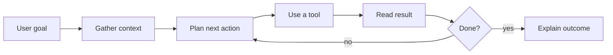

# Understanding AI Agents

AI agents are AI assistants that can do useful work across tools. They can read files, search docs, inspect logs, look at a browser, generate images, and sometimes change a project directly.

That makes them especially useful for 3D work. A Needle Engine project is not just code in one file. It can include Unity or Blender scenes, exported glTF assets, npm packages, browser logs, performance data, materials, lights, XR devices, and a live three.js scene. A good agent can move between those layers and help you understand what is actually happening.

This page is an **Explanation** page in the Diátaxis structure. It explains the mental model: turns, messages, tools, loops, goals, subagents, orchestration, and MCP. For setup steps, see [AI & Needle Engine](/docs/ai/) and [Needle MCP Server](/docs/ai/needle-mcp-server). For lookup, see the [AI Agent Glossary](/docs/reference/ai-agent-glossary).

:::tip Want the short version?
Use the [Needle Engine skill](/docs/ai/#code-with-ai) when you want an AI coding assistant that understands Needle Engine. Use the [Needle MCP Server](/docs/ai/needle-mcp-server) when you want your assistant to search Needle docs, read logs, inspect projects, or talk to live 3D scenes through the Needle Inspector.
:::

## What is an AI agent?

A normal AI chat answers from the conversation. An AI coding assistant may also edit files. An **agent** adds a working loop around that:

1. Understand the goal.
2. Gather context.
3. Choose the next action.
4. Use a tool.
5. Read the result.
6. Adjust the plan.
7. Continue until the task is done, blocked, or needs human input.

The loop is the key idea. The model is still generating text and tool calls, but the surrounding application gives it ways to observe the real project and act on it. That is why agents can feel so different from chat: they are not only answering, they are checking.

## What an agent does in a turn

A **turn** is one exchange in the conversation: you send a message, the agent responds, and it may call tools before it answers. A single visible turn can include a lot of work: search files, read docs, inspect a log, edit a file, run a build, read the error, and try again.

| Concept | What it means |
| --- | --- |
| Message | One item in the conversation: a user request, assistant reply, tool call, or tool result. |
| Turn | One round of interaction. One user turn can contain many tool calls. |
| Context | The information the model can currently see: messages, selected files, docs, logs, screenshots, browser state, or scene data. |
| Goal | The outcome the agent is trying to reach, such as "fix the build" or "make this selected object draggable." |
| Loop | The repeated observe, plan, act, and verify cycle an agent uses to make progress. |
| Tool | A capability outside the model, such as searching docs, reading logs, generating an image, or inspecting a scene. |
| Tool result | The output returned by a tool. Good agents read this carefully before deciding what to do next. |

In practice, an agent loop looks like this:



Good agents are not magic. They are useful because they reduce uncertainty. Instead of guessing what your scene, code, or browser is doing, they can inspect the actual project state.

## Tools make agents useful

Tools are how an agent reaches outside the chat window. Different AI clients expose different tools, but the pattern is similar:

| Tool type | Example use |
| --- | --- |
| File tools | Read `src/main.ts`, edit a component, search for `OrbitControls`, compare diffs. |
| Terminal commands | Search files, read logs, run builds, test code, inspect Git changes. |
| Browser tools | Open a local app, click through UI, take screenshots, inspect console errors, check network requests. |
| Image tools | Generate a concept image, make a texture, edit a screenshot, create a placeholder asset. |
| Documentation search | Search Needle docs, API references, forum posts, or local markdown files. |
| Scene tools | Inspect objects, materials, lights, cameras, transforms, components, and runtime state. |
| Project tools | Find the Unity, Blender, or web project path and read relevant files or logs. |

Needle leans into this model. The [Needle MCP Server](/docs/ai/needle-mcp-server) gives AI clients Needle-specific tools for documentation, project context, logs, glTF files, Blender scenes, and live 3D scenes through the [Needle Inspector](/docs/three/needle-devtools-for-threejs-chrome-extension).

## MCP in plain language

MCP means **Model Context Protocol**. It is a standard way for an AI client to discover and call external tools.

| Part | What it does |
| --- | --- |
| AI client | The app you use, such as Claude Desktop, Cursor, VS Code Copilot, Codex, or another agentic tool. |
| MCP server | A local or remote process that offers tools and context to the AI client. |
| Tool | A callable action, such as "search docs", "read log", "list files", or "get selected objects." |
| Resource | Readable context exposed by the server, such as files, docs, logs, or project metadata. |
| Transport | How the client talks to the server, commonly HTTP/SSE or stdio. |

With Needle, you can run the MCP server locally. Your AI client can then use Needle tools without you copy-pasting docs, logs, or scene details back and forth. If the Needle Inspector is connected, the agent can also understand the live scene you are looking at in the browser.

## Context is the difference

An AI assistant without context can only make an educated guess. Needle provides several ways to ground agents in real Needle information:

- The [Needle Engine skill](/docs/ai/#code-with-ai) gives AI coding assistants curated knowledge about Needle Engine patterns, APIs, and workflows.
- The [Needle MCP Server](/docs/ai/needle-mcp-server) lets AI clients search docs, inspect projects, read logs, and work with live scenes.
- [`llms.txt`](https://cloud.needle.tools/llms.txt) and [`llms-full.txt`](https://cloud.needle.tools/llms-full.txt) provide documentation files for tools that accept plain context.
- The Vite plugin writes logs to `node_modules/.needle/logs`, which lets an agent debug real browser and dev-server output.

This is where the workflow becomes practical: instead of "try checking the console", an agent can read the actual log, find the failing component, search the relevant docs, and suggest a Needle-specific fix.

## Common Needle workflows

### Ask about Needle concepts

Use documentation search or the Needle skill when you want an explanation, a code pattern, or API guidance:

> "How do I add a trigger collider in Needle Engine?"

The agent can answer with Needle-specific code and link the relevant docs instead of drifting into generic three.js advice.

### Debug a project

Give the agent access to logs and project files:

> "The scene is black on Quest. Read the logs and tell me what to check next."

The useful loop is: inspect logs, identify the likely cause, suggest a change, run or rebuild if possible, then check again.

### Inspect a live scene

Connect the Needle Inspector and MCP server:

> "Show me all lights in the scene and explain why the product model looks flat."

The agent can inspect scene objects and material settings instead of guessing from a screenshot.

### Make targeted edits

Agents are strongest when the target is clear:

> "Add OrbitControls to the selected camera and set the target to the product center."

With the right tools, the agent can inspect the selection, add a component, change properties, and verify the result.

## Safety and control

An agent can only use the tools its host application provides. That boundary matters:

- A chat-only AI cannot read your local files unless you paste them in or connect a tool.
- A coding agent can edit files only in the workspace or folders it is allowed to access.
- An MCP client can call only the tools exposed by configured MCP servers.
- Browser automation can see and click what the browser session can access.
- Image generation creates or edits image assets, but does not change project files unless a file tool saves the result.

For sensitive projects, keep tools local and restrict what remote AI services can access. Needle also supports disabling remote AI tools:

```bash
npx needle-cloud settings remote-ai-tools false
```

## How this fits the docs

This page belongs in **Explanation** because it answers "what is happening and why does it work this way?"

Use these other pages when you need a different kind of help:

- **Explanation:** [Understanding Terminal Commands in AI Agent Workflows](/docs/explanation/understanding-ai-agent-terminal-commands) is for people who do not usually work in a terminal and want to understand what their agent is doing.
- **How-To:** [AI & Needle Engine](/docs/ai/) and [Needle MCP Server](/docs/ai/needle-mcp-server) show setup and usage steps.
- **Reference:** [AI Agent Glossary](/docs/reference/ai-agent-glossary) defines agent and MCP terms.
- **Reference:** [Terminal Command Glossary](/docs/reference/terminal-command-glossary) is the dense lookup table for commands.

## Next steps

- Set up AI tooling: [AI & Needle Engine](/docs/ai/)
- Connect MCP: [Needle MCP Server](/docs/ai/needle-mcp-server)
- Understand terminal output: [Understanding Terminal Commands in AI Agent Workflows](/docs/explanation/understanding-ai-agent-terminal-commands)
- Look up terms: [AI Agent Glossary](/docs/reference/ai-agent-glossary)
- Look up commands: [Terminal Command Glossary](/docs/reference/terminal-command-glossary)
- Inspect live 3D scenes: [Needle Inspector for Chrome](/docs/three/needle-devtools-for-threejs-chrome-extension)
