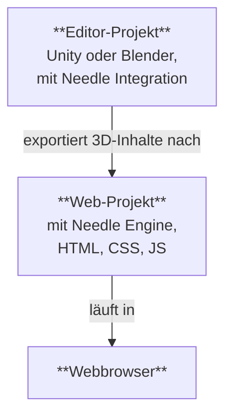

# Struktur eines Needle Engine-Projekts

Needle Engine integriert sich tief in 3D-Software wie Unity und Blender und bietet gleichzeitig die volle Flexibilität moderner Webentwicklung. Aus diesem Grund besteht ein mit Needle erstelltes Projekt in der Regel aus **zwei Teilen**: einem **Editor-Projekt** und einem **Web-Projekt**. Wir werden das Editor-Projekt oft als "Unity-Projekt" oder "Blender-Projekt" bezeichnen, je nachdem, welchen Editor Sie verwenden.



## Editor-Projekt und Web-Projekt

Das **Editor-Projekt** ist der Ort, an dem Sie Ihre 3D-Szenen erstellen, Objekten Komponenten hinzufügen, Materialien und Lichter hinzufügen, die Umgebung einrichten, animieren und so weiter. Sie können alle leistungsstarken Tools Ihrer 3D-Software verwenden, um die Inhalte zu erstellen, die ins Web exportiert werden. Wenn Sie mit Unity oder Blender arbeiten, sollten Sie das [Needle Engine for Unity](./unity/)-Paket oder das [Needle Engine for Blender](./blender/)-Add-on installieren.

Das **Web-Projekt** ist der Ort, an dem Ihre Web-App zusammenkommt. Es enthält die exportierten 3D-Assets, die Skripte, die das Verhalten Ihrer App steuern, sowie das HTML und CSS, die das Aussehen und Gefühl definieren. Das Web-Projekt wird von Needle Engine betrieben, das für das Laden und Anzeigen Ihrer 3D-Inhalte, die Verwaltung von Skriptkomponenten und deren Lebenszyklus sowie die Nutzung der Funktionen der Webplattform wie WebXR, Audio, Netzwerk und mehr verantwortlich ist.

## Erstellen eines Web-Projekts

Standardmäßig wird das Web-Projekt **von Needle erstellt und verwaltet**, was bedeutet, dass Sie sich keine Sorgen um die Einrichtung des Pakets, das Hinzufügen von Abhängigkeiten oder das Bauen machen müssen – Sie können sich auf die Erstellung Ihrer Inhalte konzentrieren. Die Integrationen für Unity und Blender machen es einfach, ein Web-Projekt direkt aus Ihrem Editor zu erstellen.

:::: tabs
@tab Unity

Suchen Sie die Needle Engine-Komponente in Ihrer Szene oder fügen Sie sie hinzu, und klicken Sie dann auf <kbd>Projekt generieren</kbd>. Dadurch wird ein neues Web-Projekt in dem von Ihnen angegebenen Ordner erstellt.


@tab Blender

Suchen Sie das Scene-Panel und den Needle Engine-Bereich, und klicken Sie dann auf <kbd>Web-Projekt generieren</kbd>. Dadurch wird ein neues Web-Projekt in dem von Ihnen angegebenen Ordner erstellt.


@tab Über die Kommandozeile

Öffnen Sie ein Terminal und führen Sie den Befehl `npx create needle` aus, um ein neues Needle Engine-Web-Projekt zu erstellen. Der Befehl fordert Sie zur Eingabe des Projektnamens, des Frameworks und anderer Einstellungen auf. Sie können auch den Ordner angeben, in dem das Projekt erstellt werden soll.

:::tip Node.js zuerst installieren
Stellen Sie sicher, dass [Node.js](https://nodejs.org/) auf Ihrem System installiert ist.
Sie können prüfen, ob es installiert ist, indem Sie `node -v` in Ihrem Terminal ausführen.
Wenn Sie es nicht installiert haben, laden Sie es von der [Node.js-Website](https://nodejs.org/) herunter und installieren Sie es.
:::

```bash
% npm create needle

> create-needle

create-needle version 0.1.1-alpha

┌  Welcome to Needle Engine! 🌵
│
◇  Where should we create your project?
│  my-project
│
◇  What framework do you want to use?
│  HTML, CSS, JavaScript with Vite
│
└  Your project is ready!

Next steps:
  1: cd my-project
  2: npm install (or npm i)
  3: npm start (or npm run dev)
  4: Connect an integration (Unity, Blender, ...)
```

::::

::: tip Eigenes Projekt mitbringen
Needle Engine ist sehr flexibel. Sie können das bestehende Web-Projekt ändern oder Ihr eigenes verwenden. Das ermöglicht Ihnen die Integration in bestehende Projekte, die Verwendung eines anderen Build-Systems oder die Verwendung eines anderen Frameworks wie React, Vue oder Angular.
:::

## Öffnen des Web-Projekts in einem Code-Editor

Wir empfehlen [Visual Studio Code](https://code.visualstudio.com/) als Code-Editor, da er eine hervorragende Unterstützung für die Webentwicklung im Allgemeinen und TypeScript im Besonderen bietet. Wenn Sie ein Web-Projekt generieren, erstellen wir automatisch eine `.code-workspace`-Datei, die Sie in Visual Studio Code öffnen können. Diese Datei enthält die Konfiguration für den Arbeitsbereich, einschließlich der einzuschließenden Ordner und der Einstellungen für den Editor.

::: tabs
@tab Unity

Klicken Sie auf <kbd>Code-Editor öffnen</kbd> auf der **Needle Engine**-Komponente. Dadurch wird das Web-Projekt in Visual Studio Code geöffnet, wobei alle Ordner und Dateien enthalten sind.


@tab Blender

Klicken Sie auf <kbd>Code-Editor öffnen</kbd> im Panel **Scene > Needle Engine**. Dadurch wird das Web-Projekt in Visual Studio Code geöffnet, wobei alle Ordner und Dateien enthalten sind.


@tab Im Explorer oder Finder finden

Doppelklicken Sie auf die `.code-workspace`-Datei. Dadurch wird das Web-Projekt in Visual Studio Code geöffnet, wobei alle Ordner und Dateien enthalten sind. Sie können den Web-Projektordner natürlich auch in anderen Code-Editoren öffnen, wenn Sie dies bevorzugen.


:::

## Verständnis der Dateien und Ordner im Web-Projekt

Das Standard-Web-Projekt basiert auf einer Standardstruktur, die modernen Webentwicklungspraktiken folgt. Es verwendet das hervorragende [Vite](https://vitejs.dev/) als Entwicklungsumgebung, Bundler und Build-Tool. Die folgenden Abschnitte beschreiben die Struktur eines typischen Needle Engine Web-Projekts.

:::tip Die Orte, mit denen Sie am häufigsten interagieren, sind `src/scripts/` und `build/`.
Fügen Sie Ihre eigenen Komponenten zu `src/scripts/` hinzu. Sie schreiben sie in TypeScript.

Beim Bauen Ihres Web-Projekts, entweder durch Klicken auf "Build" im Editor oder durch Ausführen von `npm run build`, werden die endgültigen Dateien im Ordner `dist/` abgelegt. Dies ist der Ordner, den Sie auf einen Webserver hochladen können, um Ihre Web-App zu hosten.
:::

:::: file-tree name="Web Project File"

::: file index.html
Die Startseite Ihres Web-Projekts. Sie können hier zusätzliches HTML, Stylesheets oder Skript-Imports hinzufügen. Benutzerdefinierte Needle-Komponenten sollten in den Ordner `src/scripts/` gelegt werden.
<br>
Hier finden Sie auch die `<needle-engine>` Webkomponente, die Ihre 3D-Inhalte anzeigt. Sie können ihre Attribute ändern, um die Umgebung, den Ladestil, die Kontaktschatten und mehr zu beeinflussen. Eine Liste der verfügbaren Attribute finden Sie in der [Webkomponenten-Attribute-Referenz](./reference/needle-engine-attributes.md).

:::

::: file assets/
Der Assets-Ordner enthält 3D- und andere Dateien, die von der Integration exportiert wurden. Dazu gehören `.glb`-Dateien, Audio- oder Videodateien. Der Ordner wird von der Integration verwaltet, wenn Sie also zusätzliche Assets hinzufügen möchten, legen Sie diese stattdessen in `include/`.
:::

::: file assets/MyScene.glb
Die exportierte 3D-Szene aus Unity oder Blender wird hier automatisch platziert. Der Dateiname hängt davon ab, wie Ihre Unity- oder Blender-Szene benannt ist. Es können weitere Dateien in diesem Ordner sein, je nachdem, wie Ihr Projekt eingerichtet ist. Wenn Sie beispielsweise mehrere Szenen haben oder Audio- oder Videodateien verwenden, befinden sich diese ebenfalls hier.
:::

::: file src/
Der Quellcode Ihres Web-Projekts. Hier schreiben Sie Ihre Skripte, Stile und anderen Code, die Ihre Web-App bilden. Needle platziert hier einige generierte Dateien, und Sie können auch Ihren eigenen Code hinzufügen.
:::

::: file src/main.ts
Dieses Skript ist in `index.html` enthalten und wird beim Start ausgeführt. Es importiert `@needle-tools/engine` und lädt den Haupt-Engine-Code. Sie können hier Plugins für Needle Engine hinzufügen.
:::

::: file src/scripts/
Fügen Sie Ihre benutzerdefinierten Skripte in diesen Ordner ein. Unser [Komponenten-Compiler](./component-compiler.md) generiert daraus automatisch Stub-Komponenten für Unity und Blender.
:::

::: file src/scripts/MyComponent.ts
Ein Beispiel für ein benutzerdefiniertes Skript, das in eine Unity C#-Komponente oder ein Blender-Panel kompiliert wird. Sie können Ihre eigenen Skripte hier hinzufügen, und sie werden automatisch vom Komponenten-Compiler erkannt.
:::

::: file src/styles/
Der Styles-Ordner enthält die Stylesheets für Ihr Web-Projekt. Sie können hier zusätzliche Stylesheets hinzufügen und diese in `index.html` importieren.
:::

::: file src/styles/main.css
Das Standard-Stylesheet für Ihr Web-Projekt. Fügen Sie hier Ihre eigenen Stile hinzu oder erstellen Sie zusätzliche Stylesheets im Ordner `src/styles/`. Sie können sie in `index.html` importieren.
:::

::: file src/generated/
Die Dateien in diesem Ordner werden von der Needle-Integration **generiert und verwaltet**. Bearbeiten Sie sie nicht manuell – sie werden beim Export überschrieben.
:::

::: file src/generated/gen.js
**Diese Datei wird generiert**. Sie teilt der `<needle-engine>` Webkomponente mit, welche Datei initial geladen werden soll.
:::

::: file src/generated/meta.json
**Diese Datei wird generiert**. Sie enthält Metadaten über das Projekt, wie den Namen der Hauptszene, die verwendete Version von Needle Engine und andere Informationen.
:::

::: file src/generated/register_types.ts
**Diese Datei wird generiert**. Sie importiert automatisch benutzerdefinierte Komponenten, die Ihr Projekt verwendet, sowohl aus Ihrem Code als auch aus Abhängigkeitspaketen.
:::

::: file include/
Wenn Sie benutzerdefinierte Assets haben, die Sie zur Laufzeit laden möchten, fügen Sie sie dem `include`-Ordner hinzu. Beim Build wird dieser Ordner in den Ausgabeordner kopiert.
:::

::: file dist/
Der Ausgabeordner, in dem das gebaute Web-Projekt platziert wird. Hier wird die endgültige Web-App generiert. Er enthält die gebündelten und minifizierten Dateien, die zur Veröffentlichung auf einem Server bereit sind.
:::

::: file needle.config.json
Die [Needle Konfigurationsdatei](./reference/needle-config-json.md). Needle Integrationen und Build-Tools verwenden diese Datei. Sie enthält Informationen darüber, wohin Assets exportiert werden sollen und wo sich der Build-Ordner befindet.
:::

::: file vite.config.js
Die [Vite-Konfiguration](https://vitejs.dev/config/). Hier werden Einstellungen für das Bauen der Distribution und das Hosten des Entwicklungsservers vorgenommen. Normalerweise müssen Sie diese Datei nicht ändern, aber Sie können zusätzliche Plugins hinzufügen oder den Build-Prozess bei Bedarf anpassen.
:::

::: file package.json
Projektkonfiguration mit Name, Version, Abhängigkeiten und Entwicklungs-Skripten. Sie können hier zusätzliche npm-Pakete als Abhängigkeiten hinzufügen.
:::

::: file tsconfig.json
Dies ist die Typescript-Compiler-Konfiguration. Sie teilt TypeScript mit, dass wir moderne Skript-Funktionen verwenden.
:::

::: file .gitignore
Diese Datei legt fest, welche Dateien und Ordner vom Git-Versionskontrollsystem ignoriert werden sollen. Das Standard-Web-Projekt schließt die Ordner `/dist`, `node_modules` und `.vite` aus. Wenn Sie ein anderes Versionskontrollsystem als Git verwenden, sollten Sie diese Ordner ebenfalls ausschließen.
:::

::::

Unser Exporter kann auch mit anderen Projektstrukturen verwendet werden. Wir haben Vite als Bundler aufgrund seiner Geschwindigkeit und Flexibilität gewählt. Fühlen Sie sich frei, Ihre eigene Projektstruktur einzurichten oder einen anderen Bundler wie Webpack zu verwenden. Needle Engine ist flexibel konzipiert und kann normalerweise an Ihre Bedürfnisse angepasst werden. [Erfahren Sie mehr über Bundling und andere Frameworks](html.md).

## Erweitern des Web-Projekts

Das Web-Projekt verwendet eine branchenübliche Struktur:

-   [Node.js](https://nodejs.org/) und npm für Paketverwaltung und Build-Skripte
-   [TypeScript](https://www.typescriptlang.org/) für die Skriptprogrammierung
-   [Vite](https://vitejs.dev/) zum Ausführen des Entwicklungsservers und zum Erstellen der Produktionsversion
-   [HTML](https://developer.mozilla.org/en-US/docs/Web/HTML) und [CSS](https://developer.mozilla.org/en-US/docs/Web/CSS) für Struktur und Stil der Web-App

Sie können das Web-Projekt erweitern, indem Sie eigene Skripte, Stile und Assets hinzufügen. Sie können dem Projekt bei Bedarf zusätzliche npm-Pakete hinzufügen und den Build-Prozess durch Ändern der Datei `vite.config.js` anpassen. Für einige Anpassungen, wie das Hinzufügen von PWA-Unterstützung zu Ihrer App, bietet Needle bereits Helfer, um sie zu vereinfachen. Im Allgemeinen können Sie das Web-Projekt nach Belieben frei ändern, was Needle Engine von anderen Engines unterscheidet, die Sie zur Verwendung ihrer spezifischen Projektstruktur zwingen.

:::tip Zusätzliche Dateien in den Ausgabeordner kopieren
Sie können Ihrem Projekt zusätzliche Dateien hinzufügen, die beim Bauen in den Ausgabeordner kopiert werden sollen. Legen Sie sie entweder in den Ordner `include/` oder [konfigurieren Sie das Kopieren](./reference/needle-config-json.md) in der Datei `needle.config.json`.
:::

## Hinzufügen von HTML-Oberflächen zu Ihrem Web-Projekt

Ihr Needle Engine-Projekt ist nicht auf 3D-Inhalte beschränkt. Sie können 2D-Benutzeroberflächen mit HTML und CSS erstellen und diese mit Ihren 3D-Szenen verbinden. Dies ermöglicht es Ihnen, reichhaltige, interaktive Webanwendungen zu erstellen, die 3D- und 2D-Elemente kombinieren.

Wenn Ihr HTML und CSS komplexer wird, möchten Sie möglicherweise ein **Frontend-Framework** wie Svelte, React oder Vue verwenden. Needle Engine ist so konzipiert, dass es gut mit diesen Frameworks zusammenarbeitet, und wir bieten Beispiele und Dokumentation zur Integration. Weitere Informationen finden Sie in unseren [Frontend-Framework-Beispielen](https://engine.needle.tools/samples/#combine-2d-and-3d-with-any-framework).

Hier sind einige Ressourcen, um mit 2D-UIs in Needle Engine zu beginnen:
-   [Verwenden von HTML und CSS in Needle Engine](./html.md)
-   [SvelteKit-Beispiel](https://engine.needle.tools/samples/svelte-integration/)
-   [React-Beispiel](https://engine.needle.tools/samples/react-sample/)
-   [Vue-Beispiel](https://engine.needle.tools/samples/vue.js-integration)

Needle Engine bietet eine Konfigurationsdatei (`needle.config.json`), mit der Sie den Build-Prozess anpassen, zusätzliche Assets hinzufügen und konfigurieren können, wie das Web-Projekt gebaut wird.

## Verwenden eines Editors ohne Integration

Die Unity- und Blender-Integrationen sind nicht erforderlich, um Needle Engine zu verwenden. Mit anderen Worten, das Web-Projekt hängt nicht vom Editor-Projekt ab – es verwendet nur die exportierten 3D-Assets. Wenn Sie einen anderen Editor bevorzugen oder Ihre 3D-Assets manuell erstellen möchten, können Sie dies tun. Exportieren Sie Ihre 3D-Assets im glTF- oder GLB-Format und fügen Sie sie Ihrem Web-Projekt hinzu.

## Verwenden der Integration mit einem bestehenden Web-Projekt

Wenn Sie bereits ein Web-Projekt haben, das Sie mit Needle Engine integrieren möchten, können Sie dies folgendermaßen tun:

1.  Installieren Sie das Needle Engine-Paket für Unity oder Blender.
2.  Richten Sie Ihre Szene ein.
3.  Teilen Sie der Integration mit, wo sich Ihr Web-Projekt befindet.
4.  Konfigurieren Sie in der Datei `needle.config.json`, wo die exportierten Dateien in Ihrem Web-Projekt platziert werden sollen.
5.  Laden Sie die exportierten Assets in Ihrem Web-Projekt mithilfe der Needle Engine-API.

#### Weiterlesen

-   [Typescript-Leitfaden für Unity-Entwickler](./getting-started/for-unity-developers.md)
-   [Typescript-Grundlagen](./getting-started/typescript-essentials.md)
-   [Benutzerdefinierte Skripte schreiben](./scripting.md)
-   [Everywhere Actions](./everywhere-actions.md)

Seite automatisch übersetzt mit AI