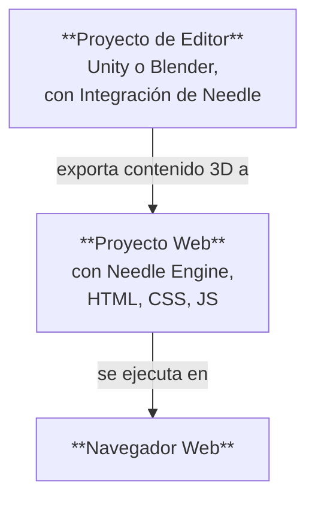

# Estructura de un proyecto de Needle Engine

Needle Engine se integra profundamente con software 3D como Unity y Blender, y al mismo tiempo tiene la flexibilidad total del desarrollo web moderno. Por esta razón, un proyecto hecho con Needle suele constar de **dos partes**: un **Proyecto de Editor** y un **Proyecto Web**. A menudo nos referiremos al Proyecto de Editor como "Proyecto de Unity" o "Proyecto de Blender", dependiendo del editor que uses.



## Proyecto de editor y proyecto web

El **Proyecto de Editor** es donde creas tus escenas 3D, añades componentes a los objetos, añades materiales y luces, configuras el entorno, animas y demás. Puedes usar todas las potentes herramientas de tu software 3D para crear el contenido que se exportará a la web. Si trabajas con Unity o Blender, querrás instalar el paquete [Needle Engine para Unity](./unity/) o el complemento [Needle Engine para Blender](./blender/).

El **Proyecto Web** es donde tu aplicación web cobra forma. Contiene los activos 3D exportados, los scripts que controlan el comportamiento de tu aplicación, y el HTML y CSS que definen la apariencia. El proyecto web está impulsado por Needle Engine, que es responsable de cargar y mostrar tu contenido 3D, gestionar los componentes de script y su ciclo de vida, y utilizar las capacidades de la plataforma web como WebXR, audio, redes y más.

## Creación de un proyecto web

Por defecto, el proyecto web es **creado y gestionado por Needle**, lo que significa que no tienes que preocuparte por cómo configurar el paquete, añadir dependencias o la compilación; puedes centrarte en crear tu contenido. Las integraciones para Unity y Blender facilitan la creación de un proyecto web directamente desde tu editor.

:::: tabs
@tab Unity

Encuentra el componente Needle Engine en tu escena o añádelo, luego haz clic en <kbd>Generar Proyecto</kbd>. Esto creará un nuevo proyecto web en la carpeta que especifiques.


@tab Blender

Encuentra el panel Escena y la sección Needle Engine, luego haz clic en <kbd>Generar Proyecto Web</kbd>. Esto creará un nuevo proyecto web en la carpeta que especifiques.


@tab Desde la línea de comandos

Abre una terminal y ejecuta el comando `npx create needle` para crear un nuevo proyecto web de Needle Engine. El comando te solicitará el nombre del proyecto, el framework y otras configuraciones. También puedes especificar la carpeta donde se debe crear el proyecto.

:::tip Instala Node.js primero
Asegúrate de tener [Node.js](https://nodejs.org/) instalado en tu sistema.
Puedes verificar si lo tienes instalado ejecutando `node -v` en tu terminal.
Si no lo tienes instalado, descárgalo e instálalo desde el [sitio web de Node.js](https://nodejs.org/).
:::

```bash
% npm create needle

> create-needle

create-needle version 0.1.1-alpha

┌  ¡Bienvenido a Needle Engine! 🌵
│
◇  ¿Dónde deberíamos crear tu proyecto?
│  my-project
│
◇  ¿Qué framework quieres usar?
│  HTML, CSS, JavaScript con Vite
│
└  ¡Tu proyecto está listo!

Siguientes pasos:
  1: cd my-project
  2: npm install (o npm i)
  3: npm start (o npm run dev)
  4: Conectar una integración (Unity, Blender, ...)
```

::::

::: tip Trae tu propio proyecto
Needle Engine es muy flexible. Puedes modificar el proyecto web existente o usar el tuyo propio. Esto te permite integrarte en proyectos existentes, usar un sistema de compilación diferente o usar un framework diferente como React, Vue o Angular.
::: 

## Abrir el proyecto web en un editor de código

Recomendamos [Visual Studio Code](https://code.visualstudio.com/) como editor de código, porque tiene un gran soporte para el desarrollo web en general, y TypeScript en particular. Cuando generas un proyecto web, creamos automáticamente un archivo `.code-workspace` que puedes abrir en Visual Studio Code. Este archivo contiene la configuración del espacio de trabajo, incluyendo las carpetas a incluir y la configuración del editor.

::: tabs
@tab Unity

Haz clic en <kbd>Abrir Editor de Código</kbd> en el componente **Needle Engine**. Esto abrirá el proyecto web en Visual Studio Code, con todas las carpetas y archivos incluidos.


@tab Blender

Haz clic en <kbd>Abrir Editor de Código</kbd> en el panel **Escena > Needle Engine**. Esto abrirá el proyecto web en Visual Studio Code, con todas las carpetas y archivos incluidos.


@tab Encontrarlo en el Explorador o Finder

Haz doble clic en el archivo `.code-workspace`. Esto abrirá el proyecto web en Visual Studio Code, con todas las carpetas y archivos incluidos. Por supuesto, también puedes abrir la carpeta del proyecto web en otros editores de código si lo prefieres.


:::

## Entendiendo los archivos y carpetas del proyecto web

El proyecto web por defecto se basa en una estructura estándar que sigue las prácticas modernas de desarrollo web. Utiliza el excelente [Vite](https://vitejs.dev/) como entorno de desarrollo, empaquetador y herramienta de compilación. Las siguientes secciones describen la estructura de un proyecto web típico de Needle Engine.

:::tip Los lugares con los que interactuarás con mayor frecuencia son `src/scripts/` y `build/`.
Añade tus propios componentes a `src/scripts/`. Los escribes en TypeScript.

Al compilar tu proyecto web, ya sea haciendo clic en "Build" en el editor o ejecutando `npm run build`, los archivos finales se colocan en la carpeta `dist/`. Esta es la carpeta que puedes subir a un servidor web para alojar tu aplicación web.
:::

:::: file-tree name="Archivo de Proyecto Web"

::: file index.html
La página de inicio de tu proyecto web. Aquí puedes añadir HTML, hojas de estilo o importaciones de scripts adicionales. Los componentes personalizados de Needle deben colocarse en la carpeta `src/scripts/`.
<br>
Aquí también encontrarás el componente web `<needle-engine>`, que muestra tu contenido 3D. Puedes modificar sus atributos para cambiar el entorno, el estilo de carga, las sombras de contacto y más. Consulta la [Referencia de Atributos del Componente Web](./reference/needle-engine-attributes.md) para ver una lista de los atributos disponibles.

:::

::: file assets/
La carpeta de activos contiene archivos 3D y otros archivos exportados por la integración. Esto incluye archivos `.glb`, archivos de audio o vídeo. La carpeta es gestionada por la integración, así que si quieres añadir activos adicionales, ponlos en `include/` en su lugar.
:::

::: file assets/MyScene.glb
La escena 3D exportada desde Unity o Blender se coloca automáticamente aquí. El nombre del archivo depende de cómo se llame tu escena de Unity o Blender. Puede haber más archivos en esta carpeta, dependiendo de cómo esté configurado tu proyecto. Por ejemplo, si tienes varias escenas, o usas archivos de audio o vídeo, también estarán aquí.
:::

::: file src/
El código fuente de tu proyecto web. Aquí es donde escribes tus scripts, estilos y otro código que compone tu aplicación web. Needle coloca algunos archivos generados aquí, y también puedes añadir tu propio código.
:::

::: file src/main.ts
Este script se incluye desde `index.html` y se ejecuta al inicio. Importa `@needle-tools/engine` y carga el código principal del motor. Aquí puedes añadir plugins para Needle Engine.
:::

::: file src/scripts/
Añade tus scripts personalizados en esta carpeta. Nuestro [compilador de componentes](./component-compiler.md) generará automáticamente componentes de marcador de posición para Unity y Blender a partir de ellos.
:::

::: file src/scripts/MyComponent.ts
Un ejemplo de un script personalizado que se compilará en un componente C# de Unity o un panel de Blender. Puedes añadir tus propios scripts aquí, y serán detectados automáticamente por el compilador de componentes.
:::

::: file src/styles/
La carpeta de estilos contiene las hojas de estilo para tu proyecto web. Puedes añadir hojas de estilo adicionales aquí e importarlas en `index.html`.
:::

::: file src/styles/main.css
La hoja de estilo por defecto para tu proyecto web. Añade tus propios estilos aquí, o crea hojas de estilo adicionales en la carpeta `src/styles/`. Puedes importarlas en `index.html`.
:::

::: file src/generated/
Los archivos de esta carpeta son **generados y gestionados** por la integración de Needle. No los edites manualmente, se sobrescribirán al exportar.
:::

::: file src/generated/gen.js
**Este archivo es generado**. Le indica al componente web `<needle-engine>` qué archivo cargar inicialmente.
:::

::: file src/generated/meta.json
**Este archivo es generado**. Contiene metadatos sobre el proyecto, como el nombre de la escena principal, la versión de Needle Engine utilizada y otra información.
:::

::: file src/generated/register_types.ts
**Este archivo es generado**. Importa automáticamente los componentes personalizados que utiliza tu proyecto, tanto de tu código como de paquetes de dependencia.
:::

::: file include/
Si tienes activos personalizados que deseas cargar en tiempo de ejecución, añádelos a la carpeta include. Al compilar, esta carpeta se copiará a la carpeta de salida.
:::

::: file dist/
La carpeta de salida donde se coloca el proyecto web compilado. Aquí es donde se genera la aplicación web final. Contiene los archivos empaquetados y minificados que están listos para ser publicados en un servidor.
:::

::: file needle.config.json
La [configuración de Needle](./reference/needle-config-json.md). Las integraciones de Needle y las herramientas de compilación utilizan este archivo. Contiene información sobre dónde exportar los activos y dónde está la carpeta de compilación.
:::

::: file vite.config.js
La [configuración de Vite](https://vitejs.dev/config/). Aquí se realizan los ajustes para compilar la distribución y alojar el servidor de desarrollo. Normalmente, no necesitas cambiar este archivo, pero puedes añadir plugins adicionales o modificar el proceso de compilación si es necesario.
:::

::: file package.json
Configuración del proyecto que contiene nombre, versión, dependencias y scripts de desarrollo. Puedes añadir paquetes npm adicionales como dependencias aquí.
:::

::: file tsconfig.json
Esta es la configuración del compilador de Typescript. Le indica a TypeScript que estamos usando características modernas de scripting.
:::

::: file .gitignore
Este archivo especifica qué archivos y carpetas deben ser ignorados por el sistema de control de versiones git. El proyecto web por defecto excluye las carpetas `/dist`, `node_modules` y `.vite`. Si utilizas otro sistema de control de versiones que no sea git, deberías excluir estas carpetas.
::: 

::::

Nuestro exportador también se puede utilizar con otras estructuras de proyecto. Elegimos Vite como empaquetador por su velocidad y flexibilidad. No dudes en configurar tu propia estructura de proyecto o utilizar un empaquetador diferente como Webpack. Needle Engine está diseñado para ser flexible y normalmente se puede adaptar a tus necesidades. [Más información sobre el empaquetado y otros frameworks](html.md).

## Extensión del proyecto web

El proyecto web utiliza una estructura estándar de la industria:

- [Node.js](https://nodejs.org/) y npm para la gestión de paquetes y scripts de compilación.
- [TypeScript](https://www.typescriptlang.org/) para el scripting.
- [Vite](https://vitejs.dev/) para ejecutar el servidor de desarrollo y compilar la versión de producción.
- [HTML](https://developer.mozilla.org/en-US/docs/Web/HTML) y [CSS](https://developer.mozilla.org/en-US/docs/Web/CSS) para la estructura y el estilo de la aplicación web.

Puedes extender el proyecto web añadiendo tus propios scripts, estilos y activos. Puedes añadir paquetes npm adicionales al proyecto según sea necesario, y puedes personalizar el proceso de compilación modificando el archivo `vite.config.js`. Para algunas personalizaciones, como añadir soporte PWA a tu aplicación, Needle ya proporciona ayudas para facilitarlas. Generalmente, puedes modificar libremente el proyecto web como te parezca, lo que distingue a Needle Engine de otros motores que requieren que utilices su estructura de proyecto específica.

:::tip Copia de archivos adicionales a la carpeta de salida
Puedes añadir archivos adicionales a tu proyecto que quieras que se copien a la carpeta de salida al compilar. Puedes ponerlos en la carpeta `include/`, o [configurar la copia](./reference/needle-config-json.md) en el archivo `needle.config.json`.
:::

## Añadir interfaces HTML a tu proyecto web

Tu proyecto de Needle Engine no se limita al contenido 3D. Puedes crear interfaces de usuario 2D usando HTML y CSS, y conectarlas con tus escenas 3D. Esto te permite crear aplicaciones web ricas e interactivas que combinan elementos 3D y 2D.

Si tu HTML y CSS se vuelven más complejos, es posible que quieras usar un **framework frontend** como Svelte, React o Vue. Needle Engine está diseñado para funcionar bien con estos frameworks, y proporcionamos ejemplos y documentación sobre cómo integrarlos. Consulta nuestros [Ejemplos de Frameworks Frontend](https://engine.needle.tools/samples/#combine-2d-and-3d-with-any-framework) para obtener más información.

Aquí tienes algunos recursos para empezar con las interfaces de usuario 2D en Needle Engine:
- [Uso de HTML y CSS en Needle Engine](./html.md)
- [Ejemplo de SvelteKit](https://engine.needle.tools/samples/svelte-integration/)
- [Ejemplo de React](https://engine.needle.tools/samples/react-sample/)
- [Ejemplo de Vue](https://engine.needle.tools/samples/vue.js-integration)

Needle Engine proporciona un archivo de configuración (`needle.config.json`) que te permite personalizar el proceso de compilación, añadir activos adicionales y configurar cómo se compila el proyecto web.

## Uso de un editor sin integración

Las integraciones de Unity y Blender no son necesarias para usar Needle Engine. En otras palabras, el proyecto web no depende del proyecto del editor, solo usa los activos 3D exportados. Si prefieres usar un editor diferente o crear tus activos 3D manualmente, puedes hacerlo. Exporta tus activos 3D en formato glTF o GLB y añádelos a tu proyecto web.

## Uso de la integración con un proyecto web existente

Si ya tienes un proyecto web que quieres integrar con Needle Engine, puedes hacerlo siguiendo estos pasos:

1. Instala el paquete de Needle Engine para Unity o Blender.
2. Configura tu escena.
3. Indica a la integración dónde se encuentra tu proyecto web.
4. Configura dónde deben colocarse los archivos exportados en tu proyecto web. Esto se hace en el archivo `needle.config.json`.
5. Carga los activos exportados en tu proyecto web usando la API de Needle Engine.

#### Continuar leyendo

- [Guía de Typescript para Desarrolladores de Unity](./getting-started/for-unity-developers.md)
- [Conceptos Esenciales de Typescript](./getting-started/typescript-essentials.md)
- [Escribir scripts personalizados](./scripting.md)
- [Everywhere Actions](./everywhere-actions.md)

---
Página traducida automáticamente con IA