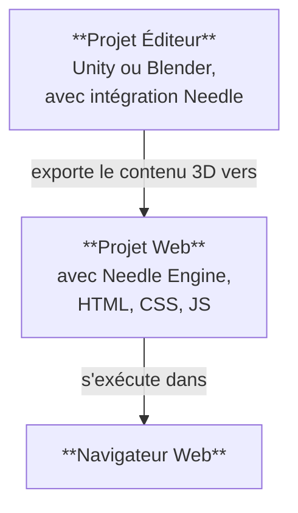

# Structure d'un projet Needle Engine

Needle Engine s'intègre profondément avec les logiciels 3D comme Unity et Blender, tout en offrant la pleine flexibilité du développement web moderne. Pour cette raison, un projet réalisé avec Needle se compose généralement de **deux parties** : un **Projet Éditeur** et un **Projet Web**. Nous ferons souvent référence au Projet Éditeur comme "Projet Unity" ou "Projet Blender", selon l'éditeur que vous utilisez.



## Projet Éditeur et Projet Web

Le **Projet Éditeur** est l'endroit où vous créez vos scènes 3D, ajoutez des composants aux objets, ajoutez des matériaux et des lumières, configurez l'environnement, animez, etc. Vous pouvez utiliser tous les outils puissants de votre logiciel 3D pour créer le contenu qui sera exporté vers le web. Si vous travaillez avec Unity ou Blender, vous voudrez installer le package [Needle Engine pour Unity](./unity/) ou l'add-on [Needle Engine pour Blender](./blender/).

Le **Projet Web** est l'endroit où votre application web prend forme. Il contient les assets 3D exportés, les scripts qui contrôlent le comportement de votre application, et le HTML et le CSS qui définissent l'apparence. Le projet web est alimenté par Needle Engine, qui est responsable du chargement et de l'affichage de votre contenu 3D, de la gestion des composants de script et de leur cycle de vie, et de l'utilisation des capacités de la plateforme web comme WebXR, l'audio, la mise en réseau, et plus encore.

## Création d'un projet web

Par défaut, le projet web est **créé et géré par Needle**, ce qui signifie que vous n'avez pas à vous soucier de la configuration du package, de l'ajout de dépendances ou de la compilation – vous pouvez vous concentrer sur la création de votre contenu. Les intégrations pour Unity et Blender facilitent la création d'un projet web directement depuis votre éditeur.

:::: tabs
@tab Unity

Trouvez le composant Needle Engine dans votre scène ou ajoutez-le, puis cliquez sur <kbd>Générer le projet</kbd>. Cela créera un nouveau projet web dans le dossier que vous spécifiez.


@tab Blender

Trouvez le panneau Scène et la section Needle Engine, puis cliquez sur <kbd>Générer le projet web</kbd>. Cela créera un nouveau projet web dans le dossier que vous spécifiez.


@tab Depuis la ligne de commande

Ouvrez un terminal et exécutez la commande `npx create needle` pour créer un nouveau projet web Needle Engine. La commande vous demandera le nom du projet, le framework et d'autres paramètres. Vous pouvez également spécifier le dossier où le projet doit être créé.

:::tip Installer Node.js d'abord
Assurez-vous d'avoir [Node.js](https://nodejs.org/) installé sur votre système.
Vous pouvez vérifier s'il est installé en exécutant `node -v` dans votre terminal.
Si vous ne l'avez pas installé, téléchargez-le et installez-le depuis le [site web de Node.js](https://nodejs.org/).
:::

```bash
% npm create needle

> create-needle

create-needle version 0.1.1-alpha

┌  Welcome to Needle Engine! 🌵
│
◇  Where should we create your project?
│  my-project
│
◇  What framework do you want to use?
│  HTML, CSS, JavaScript with Vite
│
└  Your project is ready!

Next steps:
  1: cd my-project
  2: npm install (or npm i)
  3: npm start (or npm run dev)
  4: Connect an integration (Unity, Blender, ...)
```

::::

::: tip Apportez votre propre projet
Needle Engine est très flexible. Vous pouvez modifier le projet web existant ou utiliser le vôtre. Cela vous permet de vous intégrer à des projets existants, d'utiliser un système de build différent ou d'utiliser un framework différent comme React, Vue ou Angular.
:::

## Ouverture du projet web dans un éditeur de code

Nous recommandons [Visual Studio Code](https://code.visualstudio.com/) comme éditeur de code, car il offre un excellent support pour le développement web en général, et TypeScript en particulier. Lorsque vous générez un projet web, nous créons automatiquement un fichier `.code-workspace` que vous pouvez ouvrir dans Visual Studio Code. Ce fichier contient la configuration de l'espace de travail, y compris les dossiers à inclure et les paramètres de l'éditeur.

::: tabs
@tab Unity

Cliquez sur <kbd>Ouvrir l'éditeur de code</kbd> sur le composant **Needle Engine**. Cela ouvrira le projet web dans Visual Studio Code, avec tous les dossiers et fichiers inclus.


@tab Blender

Cliquez sur <kbd>Ouvrir l'éditeur de code</kbd> sur le panneau **Scène > Needle Engine**. Cela ouvrira le projet web dans Visual Studio Code, avec tous les dossiers et fichiers inclus.


@tab Trouvez-le dans l'Explorateur ou le Finder

Double-cliquez sur le fichier `.code-workspace`. Cela ouvrira le projet web dans Visual Studio Code, avec tous les dossiers et fichiers inclus. Vous pouvez bien sûr aussi ouvrir le dossier du projet web dans d'autres éditeurs de code si vous préférez.


:::

## Comprendre les fichiers et dossiers dans le projet web

Le projet web par défaut est basé sur une structure standard qui suit les pratiques de développement web modernes. Il utilise l'excellent [Vite](https://vitejs.dev/) comme environnement de développement, bundler et outil de build. Les sections suivantes décrivent la structure d'un projet web Needle Engine typique.

:::tip Les endroits avec lesquels vous interagirez le plus souvent sont `src/scripts/` et `build/`.
Ajoutez vos propres composants à `src/scripts/`. Vous les écrivez en TypeScript.

Lorsque vous construisez votre projet web, soit en cliquant sur "Build" dans l'éditeur, soit en exécutant `npm run build`, les fichiers finaux sont placés dans le dossier `dist/`. C'est le dossier que vous pouvez télécharger sur un serveur web pour héberger votre application web.
:::

:::: file-tree name="Fichier de Projet Web"

::: file index.html
La page de démarrage de votre projet web. Vous pouvez y ajouter du HTML, des feuilles de style ou des importations de scripts supplémentaires. Les composants Needle personnalisés doivent être placés dans le dossier `src/scripts/`.  
<br>
Vous trouverez également ici le composant web `<needle-engine>`, qui affiche votre contenu 3D. Vous pouvez modifier ses attributs pour changer l'environnement, le style de chargement, les ombres de contact, et plus encore. Consultez la [Référence des attributs du composant web](./reference/needle-engine-attributes.md) pour une liste des attributs disponibles.

:::

::: file assets/
Le dossier d'assets contient les fichiers 3D et autres exportés par l'intégration. Cela inclut les fichiers `.glb`, les fichiers audio ou vidéo. Le dossier est géré par l'intégration, donc si vous voulez ajouter des assets supplémentaires, mettez-les plutôt dans `include/`.
:::

::: file assets/MyScene.glb
La scène 3D exportée depuis Unity ou Blender est automatiquement placée ici. Le nom du fichier dépend de la façon dont votre scène Unity ou Blender est nommée. Il peut y avoir plus de fichiers dans ce dossier, selon la configuration de votre projet. Par exemple, si vous avez plusieurs scènes, ou utilisez des fichiers audio ou vidéo, ils seront également ici.
:::

::: file src/
Le code source de votre projet web. C'est ici que vous écrivez vos scripts, styles et autre code qui compose votre application web. Needle place certains fichiers générés ici, et vous pouvez également ajouter votre propre code.
:::

::: file src/main.ts
Ce script est inclus depuis `index.html` et s'exécute au démarrage. Il importe `@needle-tools/engine` et charge le code principal du moteur. Vous pouvez ajouter des plugins pour Needle Engine ici.
:::

::: file src/scripts/
Ajoutez vos scripts personnalisés dans ce dossier. Notre [compilateur de composants](./component-compiler.md) générera automatiquement des composants stub pour Unity et Blender à partir de ceux-ci.
:::

::: file src/scripts/MyComponent.ts
Un exemple de script personnalisé qui sera compilé en un composant C# Unity ou un panneau Blender. Vous pouvez ajouter vos propres scripts ici, et ils seront automatiquement détectés par le compilateur de composants.
:::

::: file src/styles/
Le dossier de styles contient les feuilles de style de votre projet web. Vous pouvez y ajouter des feuilles de style supplémentaires et les importer dans `index.html`.
:::

::: file src/styles/main.css
La feuille de style par défaut de votre projet web. Ajoutez vos propres styles ici, ou créez des feuilles de style supplémentaires dans le dossier `src/styles/`. Vous pouvez les importer dans `index.html`.
:::

::: file src/generated/
Les fichiers de ce dossier sont **générés et gérés** par l'intégration Needle. Ne les modifiez pas manuellement – ils seront écrasés lors de l'exportation.
:::

::: file src/generated/gen.js
**Ce fichier est généré**. Il indique au composant web `<needle-engine>` quel fichier charger initialement.
:::

::: file src/generated/meta.json
**Ce fichier est généré**. Il contient des métadonnées sur le projet, telles que le nom de la scène principale, la version de Needle Engine utilisée et d'autres informations.
:::

::: file src/generated/register_types.ts
**Ce fichier est généré**. Il importe automatiquement les composants personnalisés utilisés par votre projet, à la fois depuis votre code et depuis les packages de dépendances.
:::

::: file include/
Si vous avez des assets personnalisés que vous souhaitez charger à l'exécution, ajoutez-les au dossier include. Lors de la construction, ce dossier sera copié dans le dossier de sortie.
:::

::: file dist/
Le dossier de sortie où est placé le projet web construit. C'est là que l'application web finale est générée. Il contient les fichiers regroupés et minifiés qui sont prêts à être publiés sur un serveur.
:::

::: file needle.config.json
La [configuration Needle](./reference/needle-config-json.md). Les intégrations Needle et les outils de build utilisent ce fichier. Il contient des informations sur l'endroit où exporter les assets et l'emplacement du dossier de build.
:::

::: file vite.config.js
La [configuration de vite](https://vitejs.dev/config/). Les paramètres pour la construction de la distribution et l'hébergement du serveur de développement sont définis ici. Habituellement, vous n'avez pas besoin de modifier ce fichier, mais vous pouvez ajouter des plugins supplémentaires ou modifier le processus de build si nécessaire.
:::

::: file package.json
Configuration du projet contenant le nom, la version, les dépendances et les scripts de développement. Vous pouvez ajouter des packages npm supplémentaires comme dépendances ici.
:::

::: file tsconfig.json
Ceci est la configuration du compilateur Typescript. Elle indique à TypeScript que nous utilisons des fonctionnalités de script modernes.
:::

::: file .gitignore
Ce fichier spécifie quels fichiers et dossiers doivent être ignorés par le système de contrôle de version git. Le projet web par défaut exclut les dossiers `/dist`, `node_modules` et `.vite`. Si vous utilisez un autre système de contrôle de version que git, vous devriez exclure ces dossiers.
:::

::::

Notre exportateur peut également être utilisé avec d'autres structures de projet. Nous avons choisi Vite comme bundler en raison de sa rapidité et de sa flexibilité. N'hésitez pas à configurer votre propre structure de projet ou à utiliser un autre bundler comme Webpack. Needle Engine est conçu pour être flexible et peut généralement être adapté à vos besoins. [En savoir plus sur le bundling et les autres frameworks](html.md).

## Extension du projet web

Le projet web utilise une structure standard de l'industrie :

- [Node.js](https://nodejs.org/) et npm pour la gestion des packages et les scripts de build
- [TypeScript](https://www.typescriptlang.org/) pour le scripting
- [Vite](https://vitejs.dev/) pour l'exécution du serveur de développement et la construction de la version de production
- [HTML](https://developer.mozilla.org/en-US/docs/Web/HTML) et [CSS](https://developer.mozilla.org/en-US/docs/Web/CSS) pour la structure et le style de l'application web

Vous pouvez étendre le projet web en ajoutant vos propres scripts, styles et assets. Vous pouvez ajouter des packages npm supplémentaires au projet selon vos besoins, et vous pouvez personnaliser le processus de build en modifiant le fichier `vite.config.js`. Pour certaines personnalisations, comme l'ajout du support PWA à votre application, Needle fournit déjà des helpers pour les faciliter. Généralement, vous pouvez modifier librement le projet web comme bon vous semble, ce qui distingue Needle Engine des autres moteurs qui vous obligent à utiliser leur structure de projet spécifique.

:::tip Copier des fichiers supplémentaires vers le dossier de sortie
Vous pouvez ajouter des fichiers supplémentaires à votre projet que vous souhaitez copier vers le dossier de sortie lors de la construction. Placez-les soit dans le dossier `include/`, soit [configurez leur copie](./reference/needle-config-json.md) dans le fichier `needle.config.json`.
:::

## Ajout d'interfaces HTML à votre projet web

Votre projet Needle Engine n'est pas limité au contenu 3D. Vous pouvez créer des interfaces utilisateur 2D en utilisant HTML et CSS, et les connecter à vos scènes 3D. Cela vous permet de créer des applications web riches et interactives qui combinent des éléments 3D et 2D.

Si votre HTML et CSS devient plus complexe, vous pourriez vouloir utiliser un **frontend framework** comme Svelte, React ou Vue. Needle Engine est conçu pour bien fonctionner avec ces frameworks, et nous fournissons des exemples et de la documentation sur la façon de les intégrer. Consultez nos [Exemples de frameworks frontend](https://engine.needle.tools/samples/#combine-2d-and-3d-with-any-framework) pour plus d'informations.

Voici quelques ressources pour vous aider à démarrer avec les UIs 2D dans Needle Engine :
- [Utilisation de HTML et CSS dans Needle Engine](./html.md)
- [Exemple SvelteKit](https://engine.needle.tools/samples/svelte-integration/)
- [Exemple React](https://engine.needle.tools/samples/react-sample/)
- [Exemple Vue](https://engine.needle.tools/samples/vue.js-integration)

Needle Engine fournit un fichier de configuration (`needle.config.json`) qui vous permet de personnaliser le processus de build, d'ajouter des assets supplémentaires et de configurer la manière dont le projet web est construit.

## Utilisation d'un éditeur sans intégration

Les intégrations Unity et Blender ne sont pas obligatoires pour utiliser Needle Engine. En d'autres termes, le projet web ne dépend pas du projet éditeur – il utilise uniquement les assets 3D exportés. Si vous préférez utiliser un éditeur différent ou créer vos assets 3D manuellement, vous pouvez le faire. Exportez vos assets 3D au format glTF ou GLB, et ajoutez-les à votre projet web.

## Utilisation de l'intégration avec un projet web existant

Si vous avez déjà un projet web que vous souhaitez intégrer à Needle Engine, vous pouvez le faire en suivant ces étapes :

1. Installez le package Needle Engine pour Unity ou Blender.
2. Configurez votre scène
3. Indiquez à l'intégration où se trouve votre projet web.
4. Configurez l'emplacement dans votre projet web où les fichiers exportés doivent être placés. Cela se fait dans le fichier `needle.config.json`.
4. Chargez les assets exportés dans votre projet web en utilisant l'API de Needle Engine.

#### Poursuivre la lecture

- [Guide Typescript pour les développeurs Unity](./getting-started/for-unity-developers.md)
- [Principes essentiels de Typescript](./getting-started/typescript-essentials.md)
- [Écrire des scripts personnalisés](./scripting.md)
- [Actions Partout](./everywhere-actions.md)

Page automatiquement traduite par IA