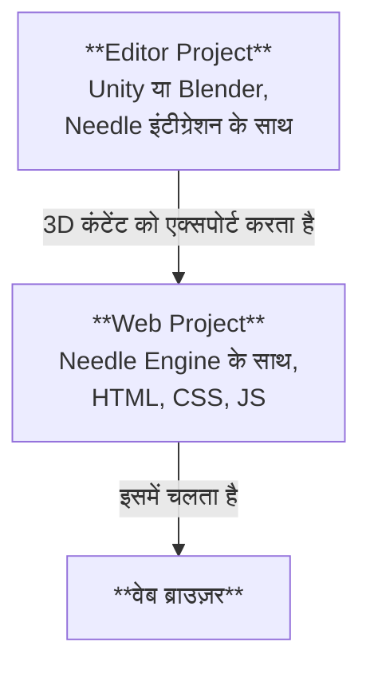

# Needle Engine प्रोजेक्ट की संरचना

Needle Engine 3D सॉफ्टवेयर जैसे Unity और Blender के साथ गहराई से एकीकृत होता है, और साथ ही आधुनिक वेब डेवलपमेंट की पूरी लचीलापन रखता है। इसी कारण से, Needle के साथ बनाया गया एक प्रोजेक्ट आमतौर पर **दो भागों** से मिलकर बनता है: एक **Editor Project** और एक **Web Project**। हम अक्सर Editor Project को "Unity Project" या "Blender Project" के रूप में संदर्भित करेंगे, यह इस पर निर्भर करता है कि आप किस एडिटर का उपयोग करते हैं।



## Editor प्रोजेक्ट और वेब प्रोजेक्ट

**Editor Project** वह जगह है जहाँ आप अपनी 3D सीन बनाते हैं, ऑब्जेक्ट में कंपोनेंट जोड़ते हैं, मटेरियल और लाइट जोड़ते हैं, एनवायरनमेंट सेट करते हैं, एनिमेट करते हैं, आदि। आप अपनी 3D सॉफ्टवेयर के सभी शक्तिशाली टूल का उपयोग करके उस कंटेंट को बना सकते हैं जिसे वेब पर एक्सपोर्ट किया जाएगा। यदि आप Unity या Blender के साथ काम कर रहे हैं, तो आप [Needle Engine for Unity](./unity/) पैकेज या [Needle Engine for Blender](./blender/) ऐड-ऑन इंस्टॉल करना चाहेंगे।

**Web Project** वह जगह है जहाँ आपका वेब ऐप एक साथ आता है। इसमें एक्सपोर्ट किए गए 3D एसेट, आपके ऐप के व्यवहार को नियंत्रित करने वाले स्क्रिप्ट और HTML और CSS शामिल हैं जो लुक और फील को परिभाषित करते हैं। वेब प्रोजेक्ट Needle Engine द्वारा संचालित होता है, जो आपकी 3D कंटेंट को लोड करने और प्रदर्शित करने, स्क्रिप्ट कंपोनेंट और उनके लाइफसाइकल को प्रबंधित करने और WebXR, ऑडियो, नेटवर्किंग और अन्य जैसी वेब प्लेटफॉर्म की क्षमताओं का उपयोग करने के लिए जिम्मेदार है।

## एक वेब प्रोजेक्ट बनाना

डिफ़ॉल्ट रूप से, वेब प्रोजेक्ट **Needle द्वारा बनाया और प्रबंधित** किया जाता है, जिसका अर्थ है कि आपको पैकेज कैसे सेट अप करें, डिपेंडेंसी जोड़ें, या बिल्डिंग के बारे में चिंता करने की आवश्यकता नहीं है – आप अपनी कंटेंट बनाने पर ध्यान केंद्रित कर सकते हैं। Unity और Blender के लिए इंटीग्रेशन आपके एडिटर से ही एक वेब प्रोजेक्ट बनाना आसान बनाते हैं।

:::: tabs
@tab यूनिटी

अपनी सीन में Needle Engine कंपोनेंट खोजें या उसे जोड़ें, फिर <kbd>Generate Project</kbd> पर क्लिक करें। यह आपके द्वारा निर्दिष्ट फ़ोल्डर में एक नया वेब प्रोजेक्ट बनाएगा।


@tab ब्लेंडर

सीन पैनल और Needle Engine सेक्शन खोजें, फिर <kbd>Generate Web Project</kbd> पर क्लिक करें। यह आपके द्वारा निर्दिष्ट फ़ोल्डर में एक नया वेब प्रोजेक्ट बनाएगा।


@tab कमांड लाइन से

एक टर्मिनल खोलें और एक नया Needle Engine वेब प्रोजेक्ट बनाने के लिए `npx create needle` कमांड चलाएं। कमांड आपसे प्रोजेक्ट का नाम, फ्रेमवर्क और अन्य सेटिंग्स के लिए प्रॉम्प्ट करेगा। आप उस फ़ोल्डर को भी निर्दिष्ट कर सकते हैं जहाँ प्रोजेक्ट बनाया जाना चाहिए।

:::tip पहले Node.js इंस्टॉल करें
सुनिश्चित करें कि आपके सिस्टम पर [Node.js](https://nodejs.org/) इंस्टॉल है।
आप अपने टर्मिनल में `node -v` चलाकर जांच सकते हैं कि यह इंस्टॉल है या नहीं।
यदि आपके पास यह इंस्टॉल नहीं है, तो इसे [Node.js वेबसाइट](https://nodejs.org/) से डाउनलोड और इंस्टॉल करें।
:::

```bash
% npm create needle

> create-needle

create-needle version 0.1.1-alpha

┌  Welcome to Needle Engine! 🌵
│
◇  Where should we create your project?
│  my-project
│
◇  What framework do you want to use?
│  HTML, CSS, JavaScript with Vite
│
└  Your project is ready!

Next steps:
  1: cd my-project
  2: npm install (or npm i)
  3: npm start (or npm run dev)
  4: Connect an integration (Unity, Blender, ...)
```

::::

::: tip अपना खुद का प्रोजेक्ट लाएं
Needle Engine बहुत लचीला है। आप मौजूदा वेब प्रोजेक्ट को संशोधित कर सकते हैं या अपना खुद का उपयोग कर सकते हैं। यह आपको मौजूदा प्रोजेक्ट में एकीकृत करने, एक अलग बिल्ड सिस्टम का उपयोग करने, या React, Vue, या Angular जैसे एक अलग फ्रेमवर्क का उपयोग करने की अनुमति देता है।
::: 

## कोड एडिटर में वेब प्रोजेक्ट खोलना

हम कोड एडिटर के रूप में [Visual Studio Code](https://code.visualstudio.com/) की सलाह देते हैं, क्योंकि इसमें सामान्य रूप से वेब डेवलपमेंट और विशेष रूप से TypeScript के लिए बहुत अच्छा समर्थन है। जब आप एक वेब प्रोजेक्ट बनाते हैं, तो हम स्वचालित रूप से एक `.code-workspace` फ़ाइल बनाते हैं जिसे आप Visual Studio Code में खोल सकते हैं। इस फ़ाइल में कार्यक्षेत्र के लिए कॉन्फ़िगरेशन होता है, जिसमें शामिल किए जाने वाले फ़ोल्डर और एडिटर की सेटिंग्स शामिल हैं।

::: tabs
@tab यूनिटी

**Needle Engine** कंपोनेंट पर <kbd>Open Code Editor</kbd> पर क्लिक करें। यह Visual Studio Code में वेब प्रोजेक्ट को सभी फ़ोल्डर और फ़ाइलों के साथ खोलेगा।


@tab ब्लेंडर

**Scene > Needle Engine** पैनल पर <kbd>Open Code Editor</kbd> पर क्लिक करें। यह Visual Studio Code में वेब प्रोजेक्ट को सभी फ़ोल्डर और फ़ाइलों के साथ खोलेगा।


@tab इसे एक्सप्लोरर या फाइंडर में खोजें

`.code-workspace` फ़ाइल पर डबल-क्लिक करें। यह Visual Studio Code में वेब प्रोजेक्ट को सभी फ़ोल्डर और फ़ाइलों के साथ खोलेगा। यदि आप चाहें तो आप वेब प्रोजेक्ट फ़ोल्डर को अन्य कोड एडिटर में भी खोल सकते हैं।


:::

## वेब प्रोजेक्ट में फ़ाइलों और फ़ोल्डरों को समझना

डिफ़ॉल्ट वेब प्रोजेक्ट एक मानक संरचना पर आधारित है जो आधुनिक वेब डेवलपमेंट प्रथाओं का पालन करती है। यह उत्कृष्ट [Vite](https://vitejs.dev/) का उपयोग डेवलपमेंट एनवायरनमेंट, बंडलर और बिल्ड टूल के रूप में करता है। निम्नलिखित अनुभाग एक विशिष्ट Needle Engine वेब प्रोजेक्ट की संरचना का वर्णन करते हैं। 


:::tip वे स्थान जिनसे आप सबसे अधिक बातचीत करेंगे वे `src/scripts/` और `build/` हैं।
अपने स्वयं के कंपोनेंट को `src/scripts/` में जोड़ें। आप उन्हें TypeScript में लिखते हैं।

अपने वेब प्रोजेक्ट को बनाते समय, या तो एडिटर में "Build" पर क्लिक करके या `npm run build` चलाकर, अंतिम फ़ाइलें `dist/` फ़ोल्डर में रखी जाती हैं। यह वह फ़ोल्डर है जिसे आप अपने वेब ऐप को होस्ट करने के लिए एक वेब सर्वर पर अपलोड कर सकते हैं।
:::

:::: file-tree name="वेब प्रोजेक्ट फ़ाइल"

::: file index.html
आपके वेब प्रोजेक्ट का स्टार्ट पेज। आप यहाँ अतिरिक्त HTML, स्टाइलशीट या स्क्रिप्ट इम्पोर्ट जोड़ सकते हैं। कस्टम Needle कंपोनेंट को `src/scripts/` फ़ोल्डर में रखा जाना चाहिए।  
<br>
आपको यहाँ `<needle-engine>` वेब कंपोनेंट भी मिलेगा, जो आपकी 3D कंटेंट को प्रदर्शित करता है। आप एनवायरनमेंट, लोडिंग स्टाइल, कॉन्टैक्ट शैडो और बहुत कुछ बदलने के लिए इसके एट्रीब्यूट को संशोधित कर सकते हैं। उपलब्ध एट्रीब्यूट की सूची के लिए [Web Component Attributes Reference](./reference/needle-engine-attributes.md) देखें।

:::

::: file assets/
एसेट फ़ोल्डर में इंटीग्रेशन द्वारा एक्सपोर्ट की गई 3D और अन्य फ़ाइलें होती हैं। इसमें `.glb` फ़ाइलें, ऑडियो या वीडियो फ़ाइलें शामिल हैं। फ़ोल्डर इंटीग्रेशन द्वारा प्रबंधित किया जाता है, इसलिए यदि आप अतिरिक्त एसेट जोड़ना चाहते हैं, तो उन्हें `include/` में डालें।
:::

::: file assets/MyScene.glb
Unity या Blender से एक्सपोर्ट की गई 3D सीन स्वचालित रूप से यहाँ रखी जाती है। फ़ाइलनाम इस बात पर निर्भर करता है कि आपकी Unity या Blender सीन का नाम कैसे रखा गया है। इस फ़ोल्डर में और भी फ़ाइलें हो सकती हैं, यह इस बात पर निर्भर करता है कि आपका प्रोजेक्ट कैसे सेट अप किया गया है। उदाहरण के लिए, यदि आपके पास कई सीन हैं, या ऑडियो या वीडियो फ़ाइलों का उपयोग करते हैं, तो वे भी यहाँ होंगे।
:::

::: file src/
आपके वेब प्रोजेक्ट का सोर्स कोड। यह वह जगह है जहाँ आप अपनी स्क्रिप्ट, स्टाइल और अन्य कोड लिखते हैं जो आपके वेब ऐप को बनाते हैं। Needle कुछ जेनरेट की गई फ़ाइलें यहाँ रखता है, और आप अपना खुद का कोड भी जोड़ सकते हैं।
:::

::: file src/main.ts
यह स्क्रिप्ट `index.html` से शामिल की जाती है और स्टार्टअप पर चलती है। यह `@needle-tools/engine` को इम्पोर्ट करती है और मुख्य इंजन कोड को लोड करती है। आप यहाँ Needle Engine के लिए प्लगइन जोड़ सकते हैं।
:::

::: file src/scripts/
इस फ़ोल्डर में अपनी कस्टम स्क्रिप्ट जोड़ें। हमारा [component compiler](./component-compiler.md) स्वचालित रूप से उनसे Unity और Blender के लिए स्टब कंपोनेंट जेनरेट करेगा।
:::

::: file src/scripts/MyComponent.ts
एक कस्टम स्क्रिप्ट का उदाहरण जिसे Unity C# कंपोनेंट या Blender पैनल में संकलित किया जाएगा। आप यहाँ अपनी खुद की स्क्रिप्ट जोड़ सकते हैं, और उन्हें कंपोनेंट कंपाइलर द्वारा स्वचालित रूप से उठाया जाएगा।
:::

::: file src/styles/
स्टाइल फ़ोल्डर में आपके वेब प्रोजेक्ट के लिए स्टाइलशीट होती हैं। आप यहाँ अतिरिक्त स्टाइलशीट जोड़ सकते हैं और उन्हें `index.html` में इम्पोर्ट कर सकते हैं।
:::

::: file src/styles/main.css
आपके वेब प्रोजेक्ट के लिए डिफ़ॉल्ट स्टाइलशीट। यहाँ अपनी खुद की स्टाइल जोड़ें, या `src/styles/` फ़ोल्डर में अतिरिक्त स्टाइलशीट बनाएं। आप उन्हें `index.html` में इम्पोर्ट कर सकते हैं।
:::

::: file src/generated/
इस फ़ोल्डर में फ़ाइलें Needle इंटीग्रेशन द्वारा **जनरेट और प्रबंधित** की जाती हैं। उन्हें मैन्युअल रूप से संपादित न करें – उन्हें एक्सपोर्ट पर अधिलेखित कर दिया जाएगा।
:::

::: file src/generated/gen.js
**यह फ़ाइल जनरेट की गई है**। यह `<needle-engine>` वेब कंपोनेंट को बताता है कि कौन सी फ़ाइल को शुरू में लोड करना है।
:::

::: file src/generated/meta.json
**यह फ़ाइल जनरेट की गई है**। इसमें प्रोजेक्ट के बारे में मेटाडेटा होता है, जैसे मुख्य सीन का नाम, उपयोग किए गए Needle Engine का वर्जन, और अन्य जानकारी।
:::

::: file src/generated/register_types.ts
**यह फ़ाइल जनरेट की गई है**। यह स्वचालित रूप से उन कस्टम कंपोनेंट को इम्पोर्ट करता है जिनका आपका प्रोजेक्ट उपयोग करता है, आपके कोड और डिपेंडेंसी पैकेज दोनों से।
:::

::: file include/
यदि आपके पास कस्टम एसेट हैं जिन्हें आप रनटाइम पर लोड करना चाहते हैं, तो उन्हें इंक्लूड फ़ोल्डर में जोड़ें। बिल्ड पर यह फ़ोल्डर आउटपुट फ़ोल्डर में कॉपी हो जाएगा।
:::

::: file dist/
आउटपुट फ़ोल्डर जहाँ निर्मित वेब प्रोजेक्ट रखा जाता है। यह वह जगह है जहाँ अंतिम वेब ऐप जनरेट होता है। इसमें बंडल की गई और मिनिफ़ाई की गई फ़ाइलें होती हैं जो सर्वर पर प्रकाशित होने के लिए तैयार होती हैं।
:::

::: file needle.config.json
[Needle कॉन्फ़िग](./reference/needle-config-json.md)। Needle इंटीग्रेशन और बिल्ड टूल इस फ़ाइल का उपयोग करते हैं। इसमें एसेट को कहाँ एक्सपोर्ट करना है, और बिल्ड फ़ोल्डर कहाँ है, इसकी जानकारी होती है।
:::

::: file vite.config.js
[vite कॉन्फ़िग](https://vitejs.dev/config/)। डिस्ट्रीब्यूशन बनाने और डेवलपमेंट सर्वर होस्ट करने की सेटिंग्स यहाँ की जाती हैं। आमतौर पर, आपको इस फ़ाइल को बदलने की आवश्यकता नहीं होती है, लेकिन यदि आवश्यक हो तो आप अतिरिक्त प्लगइन जोड़ सकते हैं या बिल्ड प्रक्रिया को संशोधित कर सकते हैं।
:::

::: file package.json
प्रोजेक्ट कॉन्फ़िगरेशन जिसमें नाम, वर्जन, डिपेंडेंसी और डेवलपमेंट स्क्रिप्ट शामिल हैं। आप यहाँ अतिरिक्त npm पैकेज को डिपेंडेंसी के रूप में जोड़ सकते हैं।
:::

::: file tsconfig.json
यह Typescript कंपाइलर कॉन्फ़िगरेशन है। यह TypeScript को बताता है कि हम आधुनिक स्क्रिप्टिंग सुविधाओं का उपयोग कर रहे हैं।
:::

::: file .gitignore
यह फ़ाइल निर्दिष्ट करती है कि किन फ़ाइलों और फ़ोल्डरों को git वर्जन कंट्रोल सिस्टम द्वारा अनदेखा किया जाना चाहिए। डिफ़ॉल्ट वेब प्रोजेक्ट `/dist`, `node_modules`, और `.vite` फ़ोल्डरों को बाहर करता है। यदि आप git के अलावा किसी अन्य वर्जन कंट्रोल सिस्टम का उपयोग कर रहे हैं, तो आपको इन फ़ोल्डरों को बाहर करना चाहिए।
::: 

::::


हमारे एक्सपोर्टर का उपयोग अन्य प्रोजेक्ट स्ट्रक्चर के साथ भी किया जा सकता है। हमने इसकी गति और लचीलेपन के कारण Vite को बंडलर के रूप में चुना। अपनी खुद की प्रोजेक्ट स्ट्रक्चर सेट अप करने, या Webpack जैसे एक अलग बंडलर का उपयोग करने के लिए स्वतंत्र महसूस करें। Needle Engine को लचीला होने के लिए डिज़ाइन किया गया है और इसे आमतौर पर आपकी आवश्यकताओं के अनुकूल बनाया जा सकता है। [बंडलिंग और अन्य फ्रेमवर्क के बारे में अधिक जानें](html.md)।

## वेब प्रोजेक्ट का विस्तार करना

वेब प्रोजेक्ट एक उद्योग-मानक संरचना का उपयोग करता है:

- [Node.js](https://nodejs.org/) और npm पैकेज प्रबंधन और बिल्ड स्क्रिप्ट के लिए
- [TypeScript](https://www.typescriptlang.org/) स्क्रिप्टिंग के लिए
- [Vite](https://vitejs.dev/) डेवलपमेंट सर्वर चलाने और प्रोडक्शन वर्जन बनाने के लिए
- [HTML](https://developer.mozilla.org/en-US/docs/Web/HTML) और [CSS](https://developer.mozilla.org/en-US/docs/Web/CSS) वेब ऐप की संरचना और स्टाइल के लिए

आप अपने स्वयं के स्क्रिप्ट, स्टाइल और एसेट जोड़कर वेब प्रोजेक्ट का विस्तार कर सकते हैं। आप आवश्यकतानुसार प्रोजेक्ट में अतिरिक्त npm पैकेज जोड़ सकते हैं, और आप `vite.config.js` फ़ाइल को संशोधित करके बिल्ड प्रक्रिया को अनुकूलित कर सकते हैं। कुछ अनुकूलन के लिए, जैसे आपके ऐप में PWA समर्थन जोड़ना, Needle पहले से ही उन्हें आसान बनाने के लिए सहायक प्रदान करता है। सामान्य तौर पर, आप वेब प्रोजेक्ट को अपनी इच्छानुसार स्वतंत्र रूप से संशोधित कर सकते हैं, जो Needle Engine को अन्य इंजनों से अलग करता है जिनके लिए आपको उनकी विशिष्ट प्रोजेक्ट संरचना का उपयोग करने की आवश्यकता होती है।


:::tip आउटपुट फ़ोल्डर में अतिरिक्त फ़ाइलें कॉपी करना
आप अपने प्रोजेक्ट में अतिरिक्त फ़ाइलें जोड़ सकते हैं जिन्हें आप बनाते समय आउटपुट फ़ोल्डर में कॉपी करना चाहते हैं। या तो उन्हें `include/` फ़ोल्डर में रखें, या `needle.config.json` फ़ाइल में [कॉपी करना कॉन्फ़िगर करें](./reference/needle-config-json.md)।
:::

## अपने वेब प्रोजेक्ट में HTML इंटरफ़ेस जोड़ना

आपका Needle Engine प्रोजेक्ट 3D कंटेंट तक सीमित नहीं है। आप HTML और CSS का उपयोग करके 2D यूजर इंटरफ़ेस बना सकते हैं, और इसे अपनी 3D सीन के साथ जोड़ सकते हैं। यह आपको रिच, इंटरैक्टिव वेब एप्लिकेशन बनाने की अनुमति देता है जो 3D और 2D तत्वों को जोड़ते हैं।

यदि आपका HTML और CSS अधिक जटिल हो जाता है, तो आप Svelte, React, या Vue जैसे **frontend framework** का उपयोग करना चाह सकते हैं। Needle Engine को इन फ्रेमवर्क के साथ अच्छी तरह से काम करने के लिए डिज़ाइन किया गया है, और हम उन्हें कैसे एकीकृत करें, इस पर उदाहरण और डॉक्यूमेंटेशन प्रदान करते हैं। अधिक जानकारी के लिए हमारे [Frontend Framework Samples](https://engine.needle.tools/samples/#combine-2d-and-3d-with-any-framework) देखें।

Needle Engine में 2D UI के साथ शुरुआत करने के लिए यहाँ कुछ संसाधन दिए गए हैं:
- [Needle Engine में HTML और CSS का उपयोग करना](./html.md)
- [SvelteKit सैंपल](https://engine.needle.tools/samples/svelte-integration/)
- [React सैंपल](https://engine.needle.tools/samples/react-sample/)
- [Vue सैंपल](https://engine.needle.tools/samples/vue.js-integration)

Needle Engine एक कॉन्फ़िगरेशन फ़ाइल (`needle.config.json`) प्रदान करता है जो आपको बिल्ड प्रक्रिया को अनुकूलित करने, अतिरिक्त एसेट जोड़ने और वेब प्रोजेक्ट को कैसे बनाया जाए, इसे कॉन्फ़िगर करने की अनुमति देता है।

## इंटीग्रेशन के बिना एडिटर का उपयोग करना

Needle Engine का उपयोग करने के लिए Unity और Blender इंटीग्रेशन की आवश्यकता नहीं है। दूसरे शब्दों में, वेब प्रोजेक्ट एडिटर प्रोजेक्ट पर निर्भर नहीं करता है – यह केवल एक्सपोर्ट किए गए 3D एसेट का उपयोग करता है। यदि आप एक अलग एडिटर का उपयोग करना या अपने 3D एसेट मैन्युअल रूप से बनाना पसंद करते हैं, तो आप ऐसा कर सकते हैं। अपने 3D एसेट को glTF या GLB फॉर्मेट में एक्सपोर्ट करें, और उन्हें अपने वेब प्रोजेक्ट में जोड़ें।

## मौजूदा वेब प्रोजेक्ट के साथ इंटीग्रेशन का उपयोग करना

यदि आपके पास पहले से ही एक वेब प्रोजेक्ट है जिसे आप Needle Engine के साथ एकीकृत करना चाहते हैं, तो आप इन चरणों का पालन करके ऐसा कर सकते हैं:

1. Unity या Blender के लिए Needle Engine पैकेज इंस्टॉल करें।
2. अपनी सीन सेट अप करें
3. इंटीग्रेशन को बताएं कि आपका वेब प्रोजेक्ट कहाँ स्थित है।
4. कॉन्फ़िगर करें कि आपके वेब प्रोजेक्ट में एक्सपोर्ट की गई फ़ाइलें कहाँ रखी जानी चाहिए। यह `needle.config.json` फ़ाइल में किया जाता है।
4. Needle Engine के API का उपयोग करके अपने वेब प्रोजेक्ट में एक्सपोर्ट किए गए एसेट लोड करें।

#### आगे पढ़ें

- [Unity डेवलपर्स के लिए Typescript गाइड](./getting-started/for-unity-developers.md)
- [Typescript आवश्यक बातें](./getting-started/typescript-essentials.md)
- [कस्टम स्क्रिप्ट लिखना](./scripting.md)
- [एवरीवेयर एक्शन](./everywhere-actions.md)


यह पृष्ठ AI का उपयोग करके स्वचालित रूप से अनुवादित किया गया है