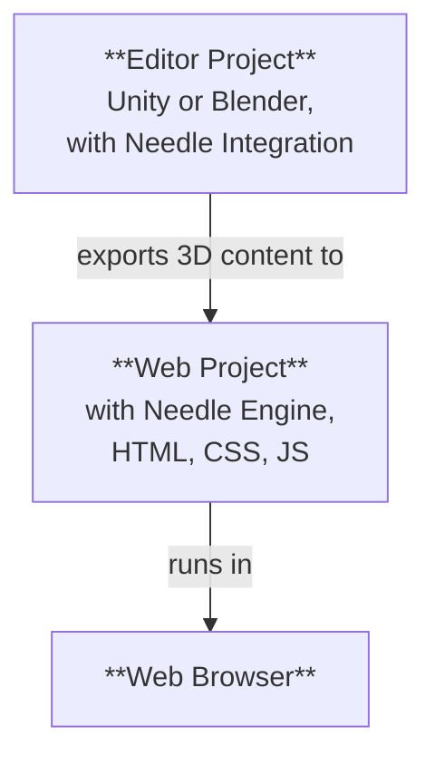

# Needle Engineプロジェクトの構造

Needle EngineはUnityやBlenderのような3Dソフトウェアと深く統合されており、同時に最新のウェブ開発の完全な柔軟性も備えています。このため、Needleで作成されたプロジェクトは通常、**2つの部分**から構成されます。**エディタープロジェクト**と**ウェブプロジェクト**です。使用するエディターに応じて、エディタープロジェクトを「Unityプロジェクト」または「Blenderプロジェクト」と呼ぶことがよくあります。



## エディタープロジェクトとウェブプロジェクト

**エディタープロジェクト**では、3Dシーンの作成、オブジェクトへのコンポーネントの追加、マテリアルやライトの追加、環境設定、アニメーションなどを行います。3Dソフトウェアの強力なツールをすべて使用して、ウェブにエクスポートされるコンテンツを作成できます。UnityまたはBlenderを使用している場合は、[Unity用Needle Engine](./unity/)パッケージまたは[Blender用Needle Engine](./blender/)アドオンをインストールすることをお勧めします。

**ウェブプロジェクト**は、ウェブアプリが一体となる場所です。エクスポートされた3Dアセット、アプリの動作を制御するスクリプト、そして外観と操作性を定義するHTMLとCSSが含まれます。ウェブプロジェクトはNeedle Engineによって駆動され、3Dコンテンツの読み込みと表示、スクリプトコンポーネントとそのライフサイクルの管理、そしてWebXR、オーディオ、ネットワーキングなどのウェブプラットフォームの機能の活用を担当します。

## ウェブプロジェクトの作成

デフォルトでは、ウェブプロジェクトは**Needleによって作成および管理されます**。これは、パッケージのセットアップ、依存関係の追加、またはビルドについて心配する必要がなく、コンテンツの作成に集中できることを意味します。UnityおよびBlenderとの統合により、エディターから直接ウェブプロジェクトを簡単に作成できます。

:::: tabs
@tab Unity

シーン内でNeedle Engineコンポーネントを見つけるか追加し、<kbd>Generate Project</kbd>をクリックします。これにより、指定したフォルダーに新しいウェブプロジェクトが作成されます。


@tab Blender

SceneパネルとNeedle Engineセクションを見つけ、<kbd>Generate Web Project</kbd>をクリックします。これにより、指定したフォルダーに新しいウェブプロジェクトが作成されます。


@tab コマンドラインから

ターミナルを開き、`npx create needle`コマンドを実行して、新しいNeedle Engineウェブプロジェクトを作成します。このコマンドは、プロジェクト名、フレームワーク、その他の設定を求めます。プロジェクトを作成するフォルダーも指定できます。

:::tip まずNode.jsをインストールしてください
システムに[Node.js](https://nodejs.org/)がインストールされていることを確認してください。
ターミナルで`node -v`を実行することで、インストールされているかどうかを確認できます。
インストールされていない場合は、[Node.jsウェブサイト](https://nodejs.org/)からダウンロードしてインストールしてください。
:::

```bash
% npm create needle

> create-needle

create-needle version 0.1.1-alpha

┌  Welcome to Needle Engine! 🌵
│
◇  Where should we create your project?
│  my-project
│
◇  What framework do you want to use?
│  HTML, CSS, JavaScript with Vite
│
└  Your project is ready!

Next steps:
  1: cd my-project
  2: npm install (or npm i)
  3: npm start (or npm run dev)
  4: Connect an integration (Unity, Blender, ...)
```

::::

::: tip 独自のプロジェクトを持参する
Needle Engineは非常に柔軟です。既存のウェブプロジェクトを変更したり、独自のプロジェクトを使用したりできます。これにより、既存のプロジェクトに統合したり、異なるビルドシステムを使用したり、React、Vue、Angularなどの異なるフレームワークを使用したりできます。
::: 

## コードエディターでウェブプロジェクトを開く

コードエディターとしては、ウェブ開発全般、特にTypeScriptに対する優れたサポートがあるため、[Visual Studio Code](https://code.visualstudio.com/)をお勧めします。ウェブプロジェクトを生成すると、Visual Studio Codeで開くことができる`.code-workspace`ファイルが自動的に作成されます。このファイルには、含めるフォルダーやエディターの設定など、ワークスペースの構成が含まれています。

::: tabs
@tab Unity

**Needle Engine**コンポーネントの<kbd>Open Code Editor</kbd>をクリックします。これにより、すべてのフォルダーとファイルが含まれた状態で、ウェブプロジェクトがVisual Studio Codeで開きます。


@tab Blender

**Scene > Needle Engine**パネルの<kbd>Open Code Editor</kbd>をクリックします。これにより、すべてのフォルダーとファイルが含まれた状態で、ウェブプロジェクトがVisual Studio Codeで開きます。


@tab ExplorerまたはFinderで見つける

`.code-workspace`ファイルをダブルクリックします。これにより、すべてのフォルダーとファイルが含まれた状態で、ウェブプロジェクトがVisual Studio Codeで開きます。もちろん、他のコードエディターでウェブプロジェクトフォルダーを開くこともできます。


:::

## ウェブプロジェクトのファイルとフォルダーを理解する

デフォルトのウェブプロジェクトは、最新のウェブ開発プラクティスに従った標準的な構造に基づいています。優れた[Vite](https://vitejs.dev/)を開発環境、バンドラー、ビルドツールとして使用しています。以下のセクションでは、典型的なNeedle Engineウェブプロジェクトの構造について説明します。 

:::tip 最も頻繁に操作する場所は`src/scripts/`と`build/`です。
独自のコンポーネントを`src/scripts/`に追加します。これらはTypeScriptで記述します。

ウェブプロジェクトをビルドする際、エディターで「Build」をクリックするか`npm run build`を実行すると、最終的なファイルは`dist/`フォルダーに配置されます。これは、ウェブアプリをホストするためにウェブサーバーにアップロードできるフォルダーです。
:::

:::: file-tree name="ウェブプロジェクトファイル"

::: file index.html
ウェブプロジェクトの開始ページです。ここにHTML、スタイルシート、スクリプトのインポートを追加できます。カスタムNeedleコンポーネントは`src/scripts/`フォルダーに入れる必要があります。  
<br>
また、3Dコンテンツを表示する`<needle-engine>`ウェブコンポーネントもここにあります。その属性を変更して、環境、読み込みスタイル、コンタクトシャドウなどを変更できます。利用可能な属性のリストについては、[ウェブコンポーネント属性リファレンス](./reference/needle-engine-attributes.md)を参照してください。

:::

::: file assets/
アセットフォルダーには、統合によってエクスポートされた3Dファイルやその他のファイルが含まれます。これには、`.glb`ファイル、オーディオファイル、またはビデオファイルが含まれます。このフォルダーは統合によって管理されるため、追加のアセットを追加したい場合は、代わりに`include/`に入れてください。
:::

::: file assets/MyScene.glb
UnityまたはBlenderからエクスポートされた3Dシーンは、自動的にここに配置されます。ファイル名は、UnityまたはBlenderのシーン名によって異なります。プロジェクトのセットアップ方法によっては、このフォルダーにさらに多くのファイルがある場合があります。たとえば、複数のシーンがある場合、またはオーディオファイルやビデオファイルを使用する場合もここにあります。
:::

::: file src/
ウェブプロジェクトのソースコードです。ここにスクリプト、スタイル、およびウェブアプリを構成するその他のコードを記述します。Needleはここに一部の生成ファイルを配置し、独自のコードも追加できます。
:::

::: file src/main.ts
このスクリプトは`index.html`からインクルードされ、起動時に実行されます。`@needle-tools/engine`をインポートし、メインエンジンコードをロードします。ここにNeedle Engine用のプラグインを追加できます。
:::

::: file src/scripts/
このフォルダーにカスタムスクリプトを追加します。[コンポーネントコンパイラ](./component-compiler.md)が、それらからUnityおよびBlender用のスタブコンポーネントを自動的に生成します。
:::

::: file src/scripts/MyComponent.ts
UnityのC#コンポーネントまたはBlenderのパネルにコンパイルされるカスタムスクリプトの例です。ここに独自のスクリプトを追加でき、それらはコンポーネントコンパイラによって自動的に認識されます。
:::

::: file src/styles/
スタイルフォルダーには、ウェブプロジェクトのスタイルシートが含まれています。ここにスタイルシートを追加し、`index.html`でインポートできます。
:::

::: file src/styles/main.css
ウェブプロジェクトのデフォルトスタイルシートです。ここに独自のスタイルを追加するか、`src/styles/`フォルダーに追加のスタイルシートを作成できます。`index.html`でインポートできます。
:::

::: file src/generated/
このフォルダーのファイルは、Needle統合によって**生成および管理**されます。手動で編集しないでください。エクスポート時に上書きされます。
:::

::: file src/generated/gen.js
**このファイルは生成されます**。`<needle-engine>`ウェブコンポーネントに、最初にどのファイルをロードするかを指示します。
:::

::: file src/generated/meta.json
**このファイルは生成されます**。メインシーンの名前、使用されているNeedle Engineのバージョン、その他の情報など、プロジェクトに関するメタデータが含まれています。
:::

::: file src/generated/register_types.ts
**このファイルは生成されます**。プロジェクトで使用されるカスタムコンポーネントを、コードと依存関係パッケージの両方から自動的にインポートします。
:::

::: file include/
ランタイム時にロードしたいカスタムアセットがある場合は、includeフォルダーに追加してください。ビルド時にこのフォルダーは出力フォルダーにコピーされます。
:::

::: file dist/
ビルドされたウェブプロジェクトが配置される出力フォルダーです。ここに最終的なウェブアプリが生成されます。サーバーに公開する準備ができたバンドルされミニファイされたファイルが含まれます。
:::

::: file needle.config.json
[Needle設定ファイル](./reference/needle-config-json.md)です。Needle統合およびビルドツールはこのファイルを使用します。アセットのエクスポート先とビルドフォルダーの場所に関する情報が含まれています。
:::

::: file vite.config.js
[vite設定](https://vitejs.dev/config/)です。配布版のビルドと開発サーバーのホスティングに関する設定がここで行われます。通常、このファイルを変更する必要はありませんが、必要に応じて追加のプラグインを追加したり、ビルドプロセスを変更したりできます。
:::

::: file package.json
名前、バージョン、依存関係、開発スクリプトを含むプロジェクト設定です。ここにnpmパッケージを追加の依存関係として追加できます。
:::

::: file tsconfig.json
これはTypescriptコンパイラ設定です。TypeScriptに、最新のスクリプト機能を使用していることを伝えます。
:::

::: file .gitignore
このファイルは、gitバージョン管理システムによって無視されるべきファイルとフォルダーを指定します。デフォルトのウェブプロジェクトでは、`/dist`、`node_modules`、および`.vite`フォルダーが除外されます。git以外のバージョン管理システムを使用している場合は、これらのフォルダーを除外する必要があります。
::: 

::::

当社のエクスポーターは、他のプロジェクト構造でも使用できます。Viteはその速度と柔軟性から、バンドラーとして選択されました。自由に独自のプロジェクト構造を設定したり、Webpackのような異なるバンドラーを使用したりしてください。Needle Engineは柔軟に設計されており、通常はニーズに合わせて適応させることができます。[バンドルと他のフレームワークについて詳しく学ぶ](html.md)。

## ウェブプロジェクトの拡張

ウェブプロジェクトは業界標準の構造を使用しています。

- [Node.js](https://nodejs.org/)とnpmによるパッケージ管理およびビルドスクリプト
- [TypeScript](https://www.typescriptlang.org/)によるスクリプト作成
- [Vite](https://vitejs.dev/)による開発サーバーの実行とプロダクション版のビルド
- ウェブアプリの構造とスタイルを定義する[HTML](https://developer.mozilla.org/en-US/docs/Web/HTML)と[CSS](https://developer.mozilla.org/en-US/docs/Web/CSS)

独自のスクリプト、スタイル、アセットを追加することで、ウェブプロジェクトを拡張できます。必要に応じて追加のnpmパッケージをプロジェクトに追加したり、`vite.config.js`ファイルを変更してビルドプロセスをカスタマイズしたりできます。アプリにPWAサポートを追加するなどの一部のカスタマイズについては、Needleがすでにヘルパーを提供しており、それらをより簡単にしています。一般的に、ウェブプロジェクトは自由に修正でき、これは特定のプロジェクト構造の使用を要求する他のエンジンとは異なるNeedle Engineの特徴です。


:::tip 追加ファイルをアウトプットフォルダーにコピーする
ビルド時に出力フォルダーにコピーしたい追加ファイルをプロジェクトに追加できます。`include/`フォルダーに入れるか、`needle.config.json`ファイルで[コピーを設定](./reference/needle-config-json.md)してください。
:::

## ウェブプロジェクトにHTMLインターフェースを追加する

Needle Engineプロジェクトは3Dコンテンツに限定されません。HTMLとCSSを使用して2Dユーザーインターフェースを作成し、3Dシーンと連携させることができます。これにより、3Dと2Dの要素を組み合わせたリッチでインタラクティブなウェブアプリケーションを作成できます。

HTMLとCSSがより複雑になる場合、Svelte、React、Vueなどの**フロントエンドフレームワーク**の使用を検討することをお勧めします。Needle Engineはこれらのフレームワークとうまく連携するように設計されており、それらを統合する方法に関する例とドキュメントを提供しています。詳細については、[フロントエンドフレームワークのサンプル](https://engine.needle.tools/samples/#combine-2d-and-3d-with-any-framework)を参照してください。

Needle Engineで2D UIを始めるためのリソースを以下に示します。
- [Needle EngineでHTMLとCSSを使用する](./html.md)
- [SvelteKitサンプル](https://engine.needle.tools/samples/svelte-integration/)
- [Reactサンプル](https://engine.needle.tools/samples/react-sample/)
- [Vueサンプル](https://engine.needle.tools/samples/vue.js-integration)

Needle Engineは、ビルドプロセスをカスタマイズし、追加のアセットを追加し、ウェブプロジェクトのビルド方法を設定できる構成ファイル（`needle.config.json`）を提供します。

## 統合なしでエディターを使用する

UnityおよびBlenderの統合は、Needle Engineを使用するために必須ではありません。つまり、ウェブプロジェクトはエディタープロジェクトに依存せず、エクスポートされた3Dアセットのみを使用します。異なるエディターを使用したり、3Dアセットを手動で作成したりしたい場合は、そうすることができます。3DアセットをglTFまたはGLB形式でエクスポートし、ウェブプロジェクトに追加してください。

## 既存のウェブプロジェクトと統合を使用する

Needle Engineと統合したい既存のウェブプロジェクトがある場合は、次の手順に従って統合できます。

1. UnityまたはBlender用のNeedle Engineパッケージをインストールします。
2. シーンを設定します
3. ウェブプロジェクトの場所を統合に伝えます。
4. エクスポートされたファイルをウェブプロジェクトのどこに配置するかを設定します。これは`needle.config.json`ファイルで行います。
4. Needle EngineのAPIを使用して、ウェブプロジェクトにエクスポートされたアセットをロードします。

#### 引き続き読む

- [Unity開発者のためのTypescriptガイド](./getting-started/for-unity-developers.md)
- [Typescriptの基礎](./getting-started/typescript-essentials.md)
- [カスタムスクリプトの記述](./scripting.md)
- [エブリウェア・アクション](./everywhere-actions.md)

---
このページはAIによって自動的に翻訳されました