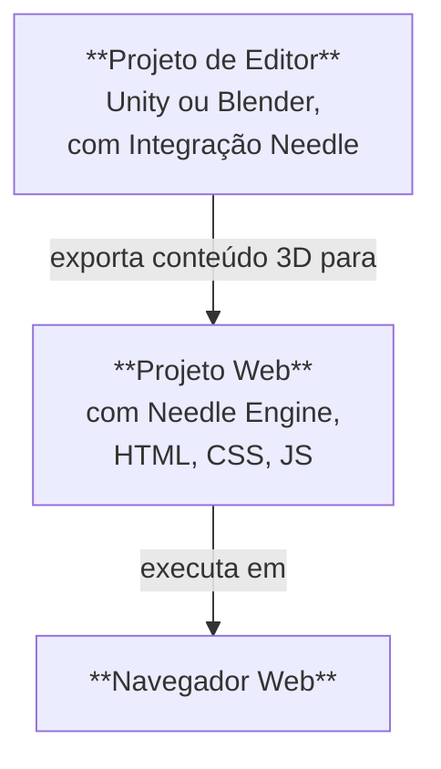

# Estrutura de um Projeto Needle Engine

O Needle Engine integra-se profundamente com softwares 3D como o Unity e o Blender, e ao mesmo tempo possui a total flexibilidade do desenvolvimento web moderno. Por esta razão, um projeto feito com Needle geralmente consiste em **duas partes**: um **Projeto de Editor** e um **Projeto Web**. Frequentemente referir-nos-emos ao Projeto de Editor como "Projeto Unity" ou "Projeto Blender", dependendo do editor que usa.



## Projeto de editor e projeto web

O **Projeto de Editor** é onde cria as suas cenas 3D, adiciona componentes a objetos, adiciona materiais e luzes, configura o ambiente, anima e assim por diante. Pode usar todas as ferramentas poderosas do seu software 3D para criar o conteúdo que será exportado para a web. Se estiver a trabalhar com Unity ou Blender, irá querer instalar o pacote [Needle Engine for Unity](./unity/) ou o add-on [Needle Engine for Blender](./blender/).

O **Projeto Web** é onde a sua aplicação web se forma. Contém os assets 3D exportados, os scripts que controlam o comportamento da sua aplicação, e o HTML e CSS que definem a aparência. O projeto web é alimentado pelo Needle Engine, que é responsável por carregar e exibir o seu conteúdo 3D, gerir os componentes de script e o seu ciclo de vida, e utilizar as capacidades da plataforma web como WebXR, áudio, rede, e mais.

## Criação de um projeto web

Por predefinição, o projeto web é **criado e gerido pelo Needle**, o que significa que não precisa de se preocupar com a configuração do pacote, adição de dependências ou compilação – pode focar-se na criação do seu conteúdo. As integrações para Unity e Blender facilitam a criação de um projeto web diretamente a partir do seu editor.

:::: tabs
@tab Unity

Encontre o componente Needle Engine na sua cena ou adicione-o, depois clique em <kbd>Gerar Projeto</kbd>. Isto irá criar um novo projeto web na pasta que especificar.


@tab Blender

Encontre o painel de Cena e a secção Needle Engine, depois clique em <kbd>Gerar Projeto Web</kbd>. Isto irá criar um novo projeto web na pasta que especificar.


@tab A partir da linha de comandos

Abra um terminal e execute o comando `npx create needle` para criar um novo projeto web Needle Engine. O comando irá pedir-lhe o nome do projeto, o framework e outras definições. Também pode especificar a pasta onde o projeto deve ser criado.

:::tip Instale o Node.js primeiro
Certifique-se de que tem o [Node.js](https://nodejs.org/) instalado no seu sistema.
Pode verificar se tem executando `node -v` no seu terminal.
Se não o tiver instalado, descarregue-o e instale-o a partir do [site do Node.js](https://nodejs.org/).
:::

```bash
% npm create needle

> create-needle

create-needle version 0.1.1-alpha

┌  Bem-vindo ao Needle Engine! 🌵
│
◇  Onde devemos criar o seu projeto?
│  my-project
│
◇  Que framework deseja usar?
│  HTML, CSS, JavaScript com Vite
│
└  O seu projeto está pronto!

Próximos passos:
  1: cd my-project
  2: npm install (ou npm i)
  3: npm start (ou npm run dev)
  4: Conectar uma integração (Unity, Blender, ...)
```

::::

::: tip Traga o seu próprio projeto
O Needle Engine é muito flexível. Pode modificar o projeto web existente ou usar o seu próprio. Isso permite-lhe integrar em projetos existentes, usar um sistema de compilação diferente ou usar um framework diferente como React, Vue ou Angular.
::: 

## Abrir o projeto web num editor de código

Recomendamos o [Visual Studio Code](https://code.visualstudio.com/) como editor de código, porque tem um excelente suporte para o desenvolvimento web em geral, e para o TypeScript em particular. Quando gera um projeto web, criamos automaticamente um ficheiro `.code-workspace` que pode abrir no Visual Studio Code. Este ficheiro contém a configuração para o espaço de trabalho, incluindo as pastas a incluir e as definições para o editor.

::: tabs
@tab Unity

Clique em <kbd>Abrir Editor de Código</kbd> no componente **Needle Engine**. Isto irá abrir o projeto web no Visual Studio Code, com todas as pastas e ficheiros incluídos.


@tab Blender

Clique em <kbd>Abrir Editor de Código</kbd> no painel **Cena > Needle Engine**. Isto irá abrir o projeto web no Visual Studio Code, com todas as pastas e ficheiros incluídos.


@tab Encontre no Explorador ou Finder

Faça duplo clique no ficheiro `.code-workspace`. Isto irá abrir o projeto web no Visual Studio Code, com todas as pastas e ficheiros incluídos. Pode, claro, também abrir a pasta do projeto web noutros editores de código, se preferir.


:::

## Compreender os ficheiros e pastas no projeto web

O projeto web predefinido baseia-se numa estrutura padrão que segue as práticas modernas de desenvolvimento web. Utiliza o excelente [Vite](https://vitejs.dev/) como ambiente de desenvolvimento, bundler e ferramenta de compilação. As secções seguintes descrevem a estrutura de um projeto web Needle Engine típico. 

:::tip Os locais com os quais mais irá interagir são `src/scripts/` e `build/`.
Adicione os seus próprios componentes a `src/scripts/`. Escreva-os em TypeScript.

Ao compilar o seu projeto web, seja clicando em "Build" no editor ou executando `npm run build`, os ficheiros finais são colocados na pasta `dist/`. Esta é a pasta que pode carregar para um servidor web para alojar a sua aplicação web.
:::

:::: file-tree name="Ficheiro do Projeto Web"

::: file index.html
A página inicial do seu projeto web. Pode adicionar HTML, folhas de estilo ou importações de scripts adicionais aqui. Os componentes Needle personalizados devem ser colocados na pasta `src/scripts/`.  
<br>
Também encontra aqui o componente web `<needle-engine>`, que exibe o seu conteúdo 3D. Pode modificar os seus atributos para alterar o ambiente, estilo de carregamento, sombras de contacto e muito mais. Consulte a [Referência de Atributos do Componente Web](./reference/needle-engine-attributes.md) para uma lista de atributos disponíveis.

:::

::: file assets/
A pasta de assets contém ficheiros 3D e outros exportados pela integração. Isto inclui ficheiros `.glb`, ficheiros de áudio ou vídeo. A pasta é gerida pela integração, por isso, se quiser adicionar assets adicionais, coloque-os em `include/` em vez disso.
:::

::: file assets/MyScene.glb
A cena 3D exportada do Unity ou Blender é automaticamente colocada aqui. O nome do ficheiro depende de como a sua cena Unity ou Blender é nomeada. Pode haver mais ficheiros nesta pasta, dependendo de como o seu projeto está configurado. Por exemplo, se tiver várias cenas, ou usar ficheiros de áudio ou vídeo, eles também estarão aqui.
:::

::: file src/
O código fonte do seu projeto web. É aqui que escreve os seus scripts, estilos e outro código que compõe a sua aplicação web. O Needle coloca alguns ficheiros gerados aqui, e também pode adicionar o seu próprio código.
:::

::: file src/main.ts
Este script é incluído a partir de `index.html` e executa ao iniciar. Ele importa `@needle-tools/engine` e carrega o código principal do motor. Pode adicionar plugins para o Needle Engine aqui.
:::

::: file src/scripts/
Adicione os seus scripts personalizados nesta pasta. O nosso [compilador de componentes](./component-compiler.md) irá gerar automaticamente componentes stub para Unity e Blender a partir deles.
:::

::: file src/scripts/MyComponent.ts
Um exemplo de um script personalizado que será compilado num componente Unity C# ou painel Blender. Pode adicionar os seus próprios scripts aqui, e eles serão automaticamente detetados pelo compilador de componentes.
:::

::: file src/styles/
A pasta de estilos contém as folhas de estilo para o seu projeto web. Pode adicionar folhas de estilo adicionais aqui e importá-las em `index.html`.
:::

::: file src/styles/main.css
A folha de estilo predefinida para o seu projeto web. Adicione os seus próprios estilos aqui, ou crie folhas de estilo adicionais na pasta `src/styles/`. Pode importá-las em `index.html`.
:::

::: file src/generated/
Os ficheiros nesta pasta são **gerados e geridos** pela integração Needle. Não os edite manualmente – serão substituídos na exportação.
:::

::: file src/generated/gen.js
**Este ficheiro é gerado**. Ele indica ao componente web `<needle-engine>` qual ficheiro carregar inicialmente.
:::

::: file src/generated/meta.json
**Este ficheiro é gerado**. Contém metadados sobre o projeto, como o nome da cena principal, a versão do Needle Engine usada e outras informações.
:::

::: file src/generated/register_types.ts
**Este ficheiro é gerado**. Ele importa automaticamente componentes personalizados que o seu projeto usa, tanto do seu código como de pacotes de dependência.
:::

::: file include/
Se tiver assets personalizados que deseja carregar em tempo de execução, adicione-os à pasta include. Ao compilar, esta pasta será copiada para a pasta de saída.
:::

::: file dist/
A pasta de saída onde o projeto web compilado é colocado. É aqui que a aplicação web final é gerada. Contém os ficheiros empacotados e minificados que estão prontos para serem publicados num servidor.
:::

::: file needle.config.json
A [configuração Needle](./reference/needle-config-json.md). As integrações Needle e as ferramentas de compilação usam este ficheiro. Ele contém informações sobre para onde exportar assets e onde está a pasta de compilação.
:::

::: file vite.config.js
A [configuração do vite](https://vitejs.dev/config/). As definições para construir a distribuição e alojar o servidor de desenvolvimento são feitas aqui. Geralmente, não precisa de alterar este ficheiro, mas pode adicionar plugins adicionais ou modificar o processo de compilação, se necessário.
:::

::: file package.json
Configuração do projeto contendo nome, versão, dependências e scripts de desenvolvimento. Pode adicionar pacotes npm adicionais como dependências aqui.
:::

::: file tsconfig.json
Esta é a configuração do compilador Typescript. Ela indica ao TypeScript que estamos a usar funcionalidades de scripting modernas.
:::

::: file .gitignore
Este ficheiro especifica quais ficheiros e pastas devem ser ignorados pelo sistema de controlo de versão git. O projeto web predefinido exclui as pastas `/dist`, `node_modules` e `.vite`. Se estiver a usar outro sistema de controlo de versão que não o git, deve excluir estas pastas.
::: 

::::


O nosso exportador pode ser usado com outras estruturas de projeto. Escolhemos o Vite como bundler devido à sua velocidade e flexibilidade. Sinta-se à vontade para configurar a sua própria estrutura de projeto ou usar um bundler diferente, como o Webpack. O Needle Engine foi concebido para ser flexível e geralmente pode ser adaptado às suas necessidades. [Saiba mais sobre bundling e outros frameworks](html.md).

## Estender o projeto web

O projeto web utiliza uma estrutura padrão da indústria:

- [Node.js](https://nodejs.org/) e npm para gestão de pacotes e scripts de compilação
- [TypeScript](https://www.typescriptlang.org/) para scripting
- [Vite](https://vitejs.dev/) para executar o servidor de desenvolvimento e construir a versão de produção
- [HTML](https://developer.mozilla.org/en-US/docs/Web/HTML) e [CSS](https://developer.mozilla.org/en-US/docs/Web/CSS) para a estrutura e estilo da aplicação web

Pode estender o projeto web adicionando os seus próprios scripts, estilos e assets. Pode adicionar pacotes npm adicionais ao projeto conforme necessário e pode personalizar o processo de compilação modificando o ficheiro `vite.config.js`. Para algumas personalizações, como adicionar suporte PWA à sua aplicação, o Needle já fornece ajudas para as tornar mais fáceis. Geralmente, pode modificar livremente o projeto web como achar melhor, o que distingue o Needle Engine de outros motores que exigem que utilize a sua estrutura de projeto específica.


:::tip Copiar ficheiros adicionais para a pasta de saída
Pode adicionar ficheiros adicionais ao seu projeto que deseja que sejam copiados para a pasta de saída ao compilar. Ou os coloca na pasta `include/`, ou [configura a cópia](./reference/needle-config-json.md) deles no ficheiro `needle.config.json`.
:::

## Adicionar interfaces HTML ao seu projeto web

O seu projeto Needle Engine não se limita a conteúdo 3D. Pode criar interfaces de utilizador 2D usando HTML e CSS, e ligá-las às suas cenas 3D. Isto permite-lhe criar aplicações web ricas e interativas que combinam elementos 3D e 2D.

Se o seu HTML e CSS se tornarem mais complexos, poderá querer usar um **framework de frontend** como Svelte, React ou Vue. O Needle Engine foi concebido para funcionar bem com estes frameworks, e fornecemos exemplos e documentação sobre como os integrar. Consulte os nossos [Exemplos de Frameworks de Frontend](https://engine.needle.tools/samples/#combine-2d-and-3d-with-any-framework) para mais informações.

Aqui estão alguns recursos para começar com UIs 2D no Needle Engine:
- [Usar HTML e CSS no Needle Engine](./html.md)
- [Exemplo SvelteKit](https://engine.needle.tools/samples/svelte-integration/)
- [Exemplo React](https://engine.needle.tools/samples/react-sample/)
- [Exemplo Vue](https://engine.needle.tools/samples/vue.js-integration)

O Needle Engine fornece um ficheiro de configuração (`needle.config.json`) que lhe permite personalizar o processo de compilação, adicionar assets adicionais e configurar como o projeto web é construído.

## Usar um Editor sem integração

As integrações Unity e Blender não são obrigatórias para usar o Needle Engine. Por outras palavras, o projeto web não depende do projeto de editor – ele apenas usa os assets 3D exportados. Se preferir usar um editor diferente ou criar os seus assets 3D manualmente, pode fazê-lo. Exporte os seus assets 3D em formato glTF ou GLB e adicione-os ao seu projeto web.

## Usar a integração com um projeto web existente

Se já tiver um projeto web que deseja integrar com o Needle Engine, pode fazê-lo seguindo estes passos:

1. Instale o pacote Needle Engine para Unity ou Blender.
2. Configure a sua cena
3. Indique à integração onde o seu projeto web está localizado.
4. Configure onde os ficheiros exportados devem ser colocados no seu projeto web. Isto é feito no ficheiro `needle.config.json`.
5. Carregue os assets exportados no seu projeto web usando a API do Needle Engine.

#### Continuar a Ler

- [Guia de Typescript para Desenvolvedores Unity](./getting-started/for-unity-developers.md)
- [Essenciais do Typescript](./getting-started/typescript-essentials.md)
- [Escrever scripts personalizados](./scripting.md)
- [Ações Everywhere](./everywhere-actions.md)


Página traduzida automaticamente usando IA