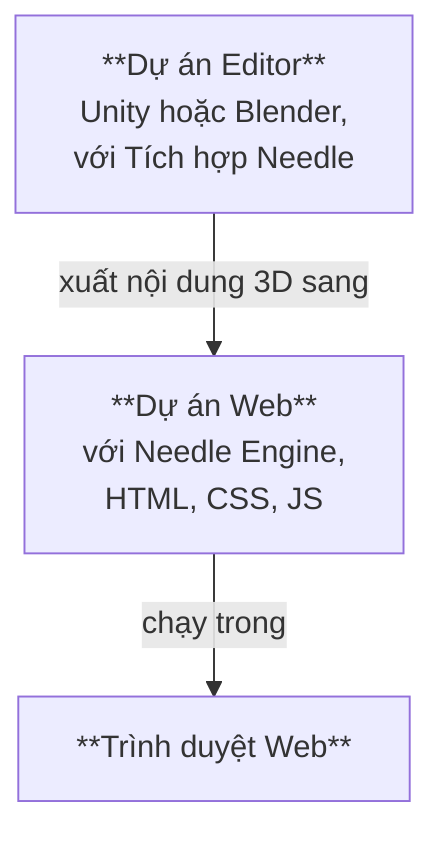

# Cấu trúc dự án Needle Engine

Needle Engine tích hợp sâu với các phần mềm 3D như Unity và Blender, đồng thời có đầy đủ sự linh hoạt của phát triển web hiện đại. Vì lý do này, một dự án được tạo bằng Needle thường bao gồm **hai phần**: một **Dự án Editor** và một **Dự án Web**. Chúng tôi thường gọi Dự án Editor là "Dự án Unity" hoặc "Dự án Blender", tùy thuộc vào trình chỉnh sửa bạn sử dụng.



## Dự án Editor và dự án Web

**Dự án Editor** là nơi bạn tạo các cảnh 3D của mình, thêm các component vào đối tượng, thêm vật liệu và ánh sáng, thiết lập môi trường, tạo hoạt ảnh, v.v. Bạn có thể sử dụng tất cả các công cụ mạnh mẽ của phần mềm 3D để tạo nội dung sẽ được xuất ra web. Nếu bạn đang làm việc với Unity hoặc Blender, bạn sẽ muốn cài đặt gói [Needle Engine for Unity](./unity/) hoặc add-on [Needle Engine for Blender](./blender/).

**Dự án Web** là nơi ứng dụng web của bạn được kết hợp. Nó chứa các tài sản 3D đã xuất, các script kiểm soát hành vi của ứng dụng và HTML cùng CSS định nghĩa giao diện người dùng. Dự án web được hỗ trợ bởi Needle Engine, chịu trách nhiệm tải và hiển thị nội dung 3D của bạn, quản lý các script component và vòng đời của chúng, và tận dụng các khả năng của nền tảng web như WebXR, âm thanh, mạng, v.v.

## Tạo một dự án web

Theo mặc định, dự án web được **tạo và quản lý bởi Needle**, nghĩa là bạn không phải lo lắng về cách thiết lập gói, thêm các phụ thuộc hoặc xây dựng – bạn có thể tập trung vào việc tạo nội dung của mình. Các tích hợp cho Unity và Blender giúp dễ dàng tạo một dự án web ngay từ trình chỉnh sửa của bạn.

:::: tabs
@tab Unity

Tìm component Needle Engine trong cảnh của bạn hoặc thêm nó, sau đó nhấp vào <kbd>Generate Project</kbd>. Thao tác này sẽ tạo một dự án web mới trong thư mục bạn chỉ định.


@tab Blender

Tìm bảng Scene và phần Needle Engine, sau đó nhấp vào <kbd>Generate Web Project</kbd>. Thao tác này sẽ tạo một dự án web mới trong thư mục bạn chỉ định.


@tab Từ dòng lệnh

Mở một terminal và chạy lệnh `npx create needle` để tạo một dự án web Needle Engine mới. Lệnh sẽ nhắc bạn nhập tên dự án, framework và các cài đặt khác. Bạn cũng có thể chỉ định thư mục nơi dự án sẽ được tạo.

:::tip Cài đặt Node.js trước
Đảm bảo bạn đã cài đặt [Node.js](https://nodejs.org/) trên hệ thống của mình.
Bạn có thể kiểm tra xem đã cài đặt chưa bằng cách chạy `node -v` trong terminal.
Nếu chưa cài đặt, hãy tải xuống và cài đặt từ trang web [Node.js](https://nodejs.org/).
:::

```bash
% npm create needle

> create-needle

create-needle version 0.1.1-alpha

┌  Chào mừng đến với Needle Engine! 🌵
│
◇  Chúng ta nên tạo dự án của bạn ở đâu?
│  my-project
│
◇  Bạn muốn sử dụng framework nào?
│  HTML, CSS, JavaScript với Vite
│
└  Dự án của bạn đã sẵn sàng!

Các bước tiếp theo:
  1: cd my-project
  2: npm install (hoặc npm i)
  3: npm start (hoặc npm run dev)
  4: Kết nối một tích hợp (Unity, Blender, ...)
```

::::

::: tip Tự mang dự án của riêng bạn
Needle Engine rất linh hoạt. Bạn có thể sửa đổi dự án web hiện có hoặc sử dụng dự án của riêng mình. Điều đó cho phép bạn tích hợp vào các dự án hiện có, sử dụng một hệ thống build khác, hoặc sử dụng một framework khác như React, Vue, hoặc Angular.
:::

## Mở dự án web trong trình chỉnh sửa mã

Chúng tôi khuyên dùng [Visual Studio Code](https://code.visualstudio.com/) làm trình chỉnh sửa mã, vì nó hỗ trợ tốt cho phát triển web nói chung, và TypeScript nói riêng. Khi bạn tạo một dự án web, chúng tôi tự động tạo một tệp `.code-workspace` mà bạn có thể mở trong Visual Studio Code. Tệp này chứa cấu hình cho workspace, bao gồm các thư mục cần đưa vào và cài đặt cho trình chỉnh sửa.

::: tabs
@tab Unity

Nhấp vào <kbd>Open Code Editor</kbd> trên component **Needle Engine**. Thao tác này sẽ mở dự án web trong Visual Studio Code, với tất cả các thư mục và tệp được bao gồm.


@tab Blender

Nhấp vào <kbd>Open Code Editor</kbd> trên bảng **Scene > Needle Engine**. Thao tác này sẽ mở dự án web trong Visual Studio Code, với tất cả các thư mục và tệp được bao gồm.


@tab Tìm trong Explorer hoặc Finder

Nhấp đúp vào tệp `.code-workspace`. Thao tác này sẽ mở dự án web trong Visual Studio Code, với tất cả các thư mục và tệp được bao gồm. Tất nhiên bạn cũng có thể mở thư mục dự án web trong các trình chỉnh sửa mã khác nếu bạn muốn.


:::

## Tìm hiểu các tệp và thư mục trong dự án web

Dự án web mặc định dựa trên cấu trúc tiêu chuẩn tuân thủ các thực hành phát triển web hiện đại. Nó sử dụng [Vite](https://vitejs.dev/) xuất sắc làm môi trường phát triển, bundler và công cụ build. Các phần sau mô tả cấu trúc của một dự án web Needle Engine điển hình.

:::tip Các vị trí bạn sẽ tương tác nhiều nhất là `src/scripts/` và `build/`.
Thêm các component của riêng bạn vào `src/scripts/`. Bạn viết chúng bằng TypeScript.

Khi build dự án web của bạn, bằng cách nhấp vào "Build" trong trình chỉnh sửa hoặc chạy `npm run build`, các tệp cuối cùng sẽ được đặt trong thư mục `dist/`. Đây là thư mục bạn có thể tải lên máy chủ web để lưu trữ ứng dụng web của mình.
:::

:::: file-tree name="Tệp dự án Web"

::: file index.html
Trang khởi đầu của dự án web của bạn. Bạn có thể thêm HTML, stylesheet hoặc import script bổ sung tại đây. Các component Needle tùy chỉnh nên được đặt trong thư mục `src/scripts/`.  
<br>
Bạn cũng tìm thấy web component `<needle-engine>` ở đây, component này hiển thị nội dung 3D của bạn. Bạn có thể sửa đổi các thuộc tính của nó để thay đổi môi trường, kiểu tải, đổ bóng liên hệ, v.v. Xem [Tham chiếu thuộc tính Web Component](./reference/needle-engine-attributes.md) để biết danh sách các thuộc tính có sẵn.

:::

::: file assets/
Thư mục asset chứa các tệp 3D và các tệp khác được xuất bởi tích hợp. Điều này bao gồm các tệp `.glb`, tệp âm thanh hoặc video. Thư mục được quản lý bởi tích hợp, vì vậy nếu bạn muốn thêm tài sản bổ sung, hãy đặt chúng vào `include/` thay thế.
:::

::: file assets/MyScene.glb
Cảnh 3D được xuất từ Unity hoặc Blender được tự động đặt tại đây. Tên tệp phụ thuộc vào cách cảnh Unity hoặc Blender của bạn được đặt tên. Có thể có nhiều tệp hơn trong thư mục này, tùy thuộc vào cách dự án của bạn được thiết lập. Ví dụ, nếu bạn có nhiều cảnh, hoặc sử dụng tệp âm thanh hoặc video, chúng cũng sẽ ở đây.
:::

::: file src/
Mã nguồn của dự án web của bạn. Đây là nơi bạn viết các script, style và các mã khác tạo nên ứng dụng web của bạn. Needle đặt một số tệp được tạo tại đây, và bạn cũng có thể thêm mã của riêng mình.
:::

::: file src/main.ts
Script này được bao gồm từ `index.html` và chạy khi khởi động. Nó import `@needle-tools/engine` và tải mã engine chính. Bạn có thể thêm các plugin cho Needle Engine tại đây.
:::

::: file src/scripts/
Thêm các script tùy chỉnh của bạn vào thư mục này. [Trình biên dịch component](./component-compiler.md) của chúng tôi sẽ tự động tạo các component stub cho Unity và Blender từ chúng.
:::

::: file src/scripts/MyComponent.ts
Một ví dụ về script tùy chỉnh sẽ được biên dịch thành component Unity C# hoặc panel Blender. Bạn có thể thêm các script của riêng mình vào đây, và chúng sẽ được trình biên dịch component tự động nhận diện.
:::

::: file src/styles/
Thư mục styles chứa các stylesheet cho dự án web của bạn. Bạn có thể thêm các stylesheet bổ sung vào đây và import chúng trong `index.html`.
:::

::: file src/styles/main.css
Stylesheet mặc định cho dự án web của bạn. Thêm các style của riêng bạn vào đây, hoặc tạo các stylesheet bổ sung trong thư mục `src/styles/`. Bạn có thể import chúng trong `index.html`.
:::

::: file src/generated/
Các tệp trong thư mục này được **tạo và quản lý** bởi tích hợp Needle. Không chỉnh sửa chúng thủ công – chúng sẽ bị ghi đè khi xuất.
:::

::: file src/generated/gen.js
**Tệp này được tạo**. Nó cho web component `<needle-engine>` biết tệp nào cần tải ban đầu.
:::

::: file src/generated/meta.json
**Tệp này được tạo**. Nó chứa siêu dữ liệu về dự án, chẳng hạn như tên của cảnh chính, phiên bản Needle Engine được sử dụng và các thông tin khác.
:::

::: file src/generated/register_types.ts
**Tệp này được tạo**. Nó tự động import các component tùy chỉnh mà dự án của bạn sử dụng, cả từ mã của bạn và từ các gói phụ thuộc.
:::

::: file include/
Nếu bạn có các tài sản tùy chỉnh mà bạn muốn tải khi chạy, hãy thêm chúng vào thư mục include. Khi build, thư mục này sẽ được sao chép vào thư mục đầu ra.
:::

::: file dist/
Thư mục đầu ra nơi dự án web đã build được đặt. Đây là nơi ứng dụng web cuối cùng được tạo. Nó chứa các tệp đã được đóng gói và nén sẵn sàng để xuất bản lên máy chủ.
:::

::: file needle.config.json
[Cấu hình Needle](./reference/needle-config-json.md). Các tích hợp và công cụ build của Needle sử dụng tệp này. Nó chứa thông tin về nơi xuất tài sản và nơi thư mục build.
:::

::: file vite.config.js
[Cấu hình Vite](https://vitejs.dev/config/). Các cài đặt để build bản phân phối và host máy chủ phát triển được thực hiện tại đây. Thông thường, bạn không cần thay đổi tệp này, nhưng bạn có thể thêm các plugin bổ sung hoặc sửa đổi quá trình build nếu cần.
:::

::: file package.json
Cấu hình dự án chứa tên, phiên bản, các phụ thuộc và các script phát triển. Bạn có thể thêm các gói npm bổ sung làm phụ thuộc tại đây.
:::

::: file tsconfig.json
Đây là cấu hình trình biên dịch Typescript. Nó cho TypeScript biết rằng chúng ta đang sử dụng các tính năng scripting hiện đại.
:::

::: file .gitignore
Tệp này chỉ định các tệp và thư mục nào nên bị bỏ qua bởi hệ thống kiểm soát phiên bản git. Dự án web mặc định loại trừ các thư mục `/dist`, `node_modules` và `.vite`. Nếu bạn đang sử dụng hệ thống kiểm soát phiên bản khác git, bạn nên loại trừ các thư mục này.
:::

::::

Exporter của chúng tôi cũng có thể được sử dụng với các cấu trúc dự án khác. Chúng tôi chọn Vite làm bundler vì tốc độ và tính linh hoạt của nó. Hãy thoải mái thiết lập cấu trúc dự án của riêng bạn, hoặc sử dụng một bundler khác như Webpack. Needle Engine được thiết kế để linh hoạt và thường có thể được điều chỉnh theo nhu cầu của bạn. [Tìm hiểu thêm về bundling và các framework khác](html.md).

## Mở rộng dự án web

Dự án web sử dụng cấu trúc tiêu chuẩn công nghiệp:

- [Node.js](https://nodejs.org/) và npm để quản lý gói và script build
- [TypeScript](https://www.typescriptlang.org/) để viết script
- [Vite](https://vitejs.dev/) để chạy máy chủ phát triển và build phiên bản sản xuất
- [HTML](https://developer.mozilla.org/en-US/docs/Web/HTML) và [CSS](https://developer.mozilla.org/en-US/docs/Web/CSS) cho cấu trúc và kiểu dáng của ứng dụng web

Bạn có thể mở rộng dự án web bằng cách thêm các script, style và tài sản của riêng mình. Bạn có thể thêm các gói npm bổ sung vào dự án khi cần, và bạn có thể tùy chỉnh quá trình build bằng cách sửa đổi tệp `vite.config.js`. Đối với một số tùy chỉnh, như thêm hỗ trợ PWA vào ứng dụng của bạn, Needle đã cung cấp các trợ giúp để làm cho chúng dễ dàng hơn. Nói chung, bạn có thể tự do sửa đổi dự án web theo ý mình, điều này làm cho Needle Engine khác biệt so với các engine khác yêu cầu bạn sử dụng cấu trúc dự án cụ thể của chúng.

:::tip Sao chép các tệp bổ sung vào thư mục đầu ra
Bạn có thể thêm các tệp bổ sung vào dự án mà bạn muốn được sao chép vào thư mục đầu ra khi build. Hãy đặt chúng vào thư mục `include/`, hoặc [cấu hình sao chép](./reference/needle-config-json.md) chúng trong tệp `needle.config.json`.
:::

## Thêm giao diện HTML vào dự án web của bạn

Dự án Needle Engine của bạn không chỉ giới hạn ở nội dung 3D. Bạn có thể tạo giao diện người dùng 2D bằng HTML và CSS, và kết nối nó với các cảnh 3D của bạn. Điều này cho phép bạn tạo các ứng dụng web tương tác, phong phú kết hợp các yếu tố 3D và 2D.

Nếu HTML và CSS của bạn trở nên phức tạp hơn, bạn có thể muốn sử dụng một **frontend framework** như Svelte, React, hoặc Vue. Needle Engine được thiết kế để hoạt động tốt với các framework này, và chúng tôi cung cấp các ví dụ và tài liệu về cách tích hợp chúng. Xem [Ví dụ về Frontend Framework](https://engine.needle.tools/samples/#combine-2d-and-3d-with-any-framework) của chúng tôi để biết thêm thông tin.

Dưới đây là một số tài nguyên để bạn bắt đầu với UI 2D trong Needle Engine:
- [Sử dụng HTML và CSS trong Needle Engine](./html.md)
- [Ví dụ SvelteKit](https://engine.needle.tools/samples/svelte-integration/)
- [Ví dụ React](https://engine.needle.tools/samples/react-sample/)
- [Ví dụ Vue](https://engine.needle.tools/samples/vue.js-integration)

Needle Engine cung cấp một tệp cấu hình (`needle.config.json`) cho phép bạn tùy chỉnh quá trình build, thêm các tài sản bổ sung và cấu hình cách dự án web được build.

## Sử dụng một Editor không có tích hợp

Các tích hợp Unity và Blender không bắt buộc phải có để sử dụng Needle Engine. Nói cách khác, dự án web không phụ thuộc vào dự án editor – nó chỉ sử dụng các tài sản 3D đã xuất. Nếu bạn muốn sử dụng một trình chỉnh sửa khác hoặc tạo các tài sản 3D của mình theo cách thủ công, bạn có thể làm như vậy. Xuất các tài sản 3D của bạn ở định dạng glTF hoặc GLB, và thêm chúng vào dự án web của bạn.

## Sử dụng tích hợp với một dự án web hiện có

Nếu bạn đã có một dự án web mà bạn muốn tích hợp với Needle Engine, bạn có thể làm như sau:

1. Cài đặt gói Needle Engine cho Unity hoặc Blender.
2. Thiết lập cảnh của bạn
3. Cho tích hợp biết dự án web của bạn nằm ở đâu.
4. Cấu hình nơi trong dự án web của bạn mà các tệp đã xuất sẽ được đặt. Điều này được thực hiện trong tệp `needle.config.json`.
4. Tải các tài sản đã xuất trong dự án web của bạn bằng API của Needle Engine.

#### Đọc thêm

- [Hướng dẫn Typescript cho Nhà phát triển Unity](./getting-started/for-unity-developers.md)
- [Những điều cơ bản về Typescript](./getting-started/typescript-essentials.md)
- [Viết script tùy chỉnh](./scripting.md)
- [Everywhere Actions](./everywhere-actions.md)

Trang được dịch tự động bằng AI