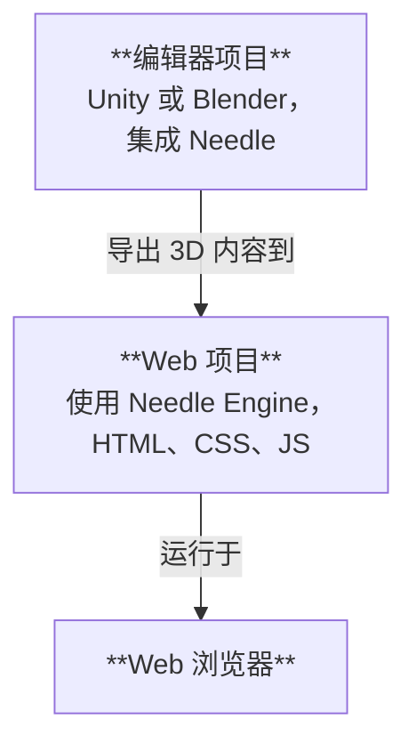

# Needle Engine 项目结构

Needle Engine 深度集成了 Unity 和 Blender 等 3D 软件，同时又具备现代 Web 开发的全部灵活性。因此，使用 Needle 创建的项目通常由**两部分**组成：一个**编辑器项目**和一个**Web 项目**。我们将根据您使用的编辑器，通常将编辑器项目称为“Unity 项目”或“Blender 项目”。



## 编辑器项目和 Web 项目

**编辑器项目**是您创建 3D 场景、向对象添加组件、添加材质和灯光、设置环境、制作动画等的地方。您可以使用 3D 软件的所有强大工具来创建将导出到 Web 的内容。如果您正在使用 Unity 或 Blender，您将需要安装 [Needle Engine for Unity](./unity/) 包或 [Needle Engine for Blender](./blender/) 插件。

**Web 项目**是您的 Web 应用程序的最终形态。它包含导出的 3D 资产、控制应用程序行为的脚本以及定义外观的 HTML 和 CSS。Web 项目由 Needle Engine 提供支持，Needle Engine 负责加载和显示您的 3D 内容、管理脚本组件及其生命周期，并利用 Web 平台的功能，如 WebXR、音频、网络等。

## 创建 Web 项目

默认情况下，Web 项目由 **Needle 创建和管理**，这意味着您无需担心如何设置包、添加依赖项或构建——您可以专注于创建内容。Unity 和 Blender 的集成使得直接从编辑器创建 Web 项目变得容易。

:::: tabs
@tab Unity

在场景中找到 Needle Engine 组件或添加它，然后点击 <kbd>生成项目</kbd>。这将在您指定的文件夹中创建一个新的 Web 项目。


@tab Blender

找到“场景”面板和“Needle Engine”部分，然后点击 <kbd>生成 Web 项目</kbd>。这将在您指定的文件夹中创建一个新的 Web 项目。


@tab 从命令行

打开终端并运行命令 `npx create needle` 来创建一个新的 Needle Engine Web 项目。该命令将提示您输入项目名称、框架和其他设置。您还可以指定项目应创建在哪个文件夹中。

:::tip 首先安装 Node.js
确保您的系统已安装 [Node.js](https://nodejs.org/)。
您可以通过在终端中运行 `node -v` 来检查是否已安装。
如果未安装，请从 [Node.js 网站](https://nodejs.org/) 下载并安装。
:::

```bash
% npm create needle

> create-needle

create-needle version 0.1.1-alpha

┌  欢迎使用 Needle Engine！🌵
│
◇  我们应该在哪里创建您的项目？
│  my-project
│
◇  您想使用哪个框架？
│  带有 Vite 的 HTML、CSS、JavaScript
│
└  您的项目已准备就绪！

下一步：
  1: cd my-project
  2: npm install (或 npm i)
  3: npm start (或 npm run dev)
  4: 连接集成（Unity, Blender, ...）
```

::::

::: tip 自带项目
Needle Engine 非常灵活。您可以修改现有 Web 项目或使用自己的项目。这允许您集成到现有项目中，使用不同的构建系统，或使用不同的框架，如 React、Vue 或 Angular。
::: 

## 在代码编辑器中打开 Web 项目

我们推荐 [Visual Studio Code](https://code.visualstudio.com/) 作为代码编辑器，因为它对通用 Web 开发，特别是 TypeScript 有很好的支持。当您生成 Web 项目时，我们会自动创建一个 `.code-workspace` 文件，您可以在 Visual Studio Code 中打开它。此文件包含工作区的配置，包括要包含的文件夹和编辑器的设置。

::: tabs
@tab Unity

点击 **Needle Engine** 组件上的 <kbd>打开代码编辑器</kbd>。这将在 Visual Studio Code 中打开 Web 项目，包含所有文件夹和文件。


@tab Blender

点击 **场景 > Needle Engine** 面板上的 <kbd>打开代码编辑器</kbd>。这将在 Visual Studio Code 中打开 Web 项目，包含所有文件夹和文件。


@tab 在 Explorer 或 Finder 中查找

双击 `.code-workspace` 文件。这将在 Visual Studio Code 中打开 Web 项目，包含所有文件夹和文件。如果您愿意，当然也可以在其他代码编辑器中打开 Web 项目文件夹。


:::

## 理解 Web 项目中的文件和文件夹

默认的 Web 项目基于遵循现代 Web 开发实践的标准结构。它使用出色的 [Vite](https://vitejs.dev/) 作为开发环境、打包器和构建工具。以下部分描述了典型 Needle Engine Web 项目的结构。

:::tip 您最常交互的地方是 `src/scripts/` 和 `build/`。
将您自己的组件添加到 `src/scripts/`。您用 TypeScript 编写它们。

当构建您的 Web 项目时，无论是通过点击编辑器中的“构建”还是运行 `npm run build`，最终文件都会放置在 `dist/` 文件夹中。这个文件夹就是您可以上传到 Web 服务器来托管您的 Web 应用程序的文件夹。
:::

:::: file-tree name="Web 项目文件"

::: file index.html
您的 Web 项目的起始页。您可以在此处添加额外的 HTML、样式表或脚本导入。自定义 Needle 组件应放在 `src/scripts/` 文件夹中。  
<br>
您还可以在此处找到 `<needle-engine>` Web 组件，它显示您的 3D 内容。您可以修改其属性以更改环境、加载样式、接触阴影等。有关可用属性的列表，请参阅 [Web 组件属性参考](./reference/needle-engine-attributes.md)。

:::

::: file assets/
资产文件夹包含由集成导出的 3D 和其他文件。这包括 `.glb` 文件、音频或视频文件。该文件夹由集成管理，因此如果您想添加其他资产，请将其放入 `include/` 中。
:::

::: file assets/MyScene.glb
从 Unity 或 Blender 导出的 3D 场景会自动放置在此处。文件名取决于您的 Unity 或 Blender 场景的命名方式。此文件夹中可能有更多文件，具体取决于您的项目设置方式。例如，如果您有多个场景，或者使用音频或视频文件，它们也会在这里。
:::

::: file src/
您的 Web 项目的源代码。您在这里编写脚本、样式和构成您的 Web 应用程序的其他代码。Needle 在这里放置了一些生成的文件，您也可以添加自己的代码。
:::

::: file src/main.ts
此脚本包含在 `index.html` 中并在启动时运行。它导入 `@needle-tools/engine` 并加载主引擎代码。您可以在此处为 Needle Engine 添加插件。
:::

::: file src/scripts/
在此文件夹中添加您的自定义脚本。我们的 [组件编译器](./component-compiler.md) 将自动从它们生成用于 Unity 和 Blender 的存根组件。
:::

::: file src/scripts/MyComponent.ts
一个自定义脚本示例，它将被编译为 Unity C# 组件或 Blender 面板。您可以在此处添加自己的脚本，它们将自动被组件编译器识别。
:::

::: file src/styles/
样式文件夹包含您的 Web 项目的样式表。您可以在此处添加其他样式表并在 `index.html` 中导入它们。
:::

::: file src/styles/main.css
您的 Web 项目的默认样式表。在此处添加您自己的样式，或在 `src/styles/` 文件夹中创建其他样式表。您可以在 `index.html` 中导入它们。
:::

::: file src/generated/
此文件夹中的文件由 Needle 集成**生成和管理**。请勿手动编辑它们——它们将在导出时被覆盖。
:::

::: file src/generated/gen.js
**此文件是生成的**。它告诉 `<needle-engine>` Web 组件最初要加载哪个文件。
:::

::: file src/generated/meta.json
**此文件是生成的**。它包含有关项目的元数据，例如主场景的名称、使用的 Needle Engine 版本以及其他信息。
:::

::: file src/generated/register_types.ts
**此文件是生成的**。它会自动导入您的项目使用的自定义组件，包括来自您的代码和依赖包的组件。
:::

::: file include/
如果您有想要在运行时加载的自定义资产，请将它们添加到 include 文件夹。构建时，此文件夹将被复制到输出文件夹。
:::

::: file dist/
构建的 Web 项目放置的输出文件夹。这是生成最终 Web 应用程序的地方。它包含打包和最小化的文件，可供发布到服务器。
:::

::: file needle.config.json
[Needle 配置](./reference/needle-config-json.md)。Needle 集成和构建工具使用此文件。它包含有关导出资产到何处以及构建文件夹在哪里的信息。
:::

::: file vite.config.js
[vite 配置](https://vitejs.dev/config/)。在此处进行构建分发和托管开发服务器的设置。通常，您不需要更改此文件，但如果需要，可以添加其他插件或修改构建过程。
:::

::: file package.json
包含名称、版本、依赖项和开发脚本的项目配置。您可以在此处添加额外的 npm 包作为依赖项。
:::

::: file tsconfig.json
这是 Typescript 编译器配置。它告诉 TypeScript 我们正在使用现代脚本功能。
:::

::: file .gitignore
此文件指定 git 版本控制系统应忽略的文件和文件夹。默认的 Web 项目排除 `/dist`、`node_modules` 和 `.vite` 文件夹。如果您使用 git 以外的其他版本控制系统，则应排除这些文件夹。
::: 

::::

我们的导出器也可以与其他项目结构一起使用。我们选择 Vite 作为打包器是因为它的速度和灵活性。您可以随意设置自己的项目结构，或使用不同的打包器，如 Webpack。Needle Engine 旨在灵活且通常可以根据您的需求进行调整。[了解有关打包和其他框架的更多信息](html.md)。

## 扩展 Web 项目

Web 项目使用行业标准结构：

- [Node.js](https://nodejs.org/) 和 npm 用于包管理和构建脚本
- [TypeScript](https://www.typescriptlang.org/) 用于脚本
- [Vite](https://vitejs.dev/) 用于运行开发服务器和构建生产版本
- [HTML](https://developer.mozilla.org/en-US/docs/Web/HTML) 和 [CSS](https://developer.mozilla.org/en-US/docs/Web/CSS) 用于 Web 应用程序的结构和样式

您可以通过添加自己的脚本、样式和资产来扩展 Web 项目。您可以根据需要向项目添加额外的 npm 包，并且可以通过修改 `vite.config.js` 文件来自定义构建过程。对于某些自定义，例如为您的应用程序添加 PWA 支持，Needle 已经提供了帮助程序使其更容易。通常，您可以根据自己的意愿自由修改 Web 项目，这使得 Needle Engine 与其他要求您使用其特定项目结构的引擎不同。

:::tip 将附加文件复制到输出文件夹
您可以向项目添加附加文件，这些文件在构建时会复制到输出文件夹。您可以将它们放入 `include/` 文件夹中，或在 `needle.config.json` 文件中[配置复制](./reference/needle-config-json.md)。
:::

## 为您的 Web 项目添加 HTML 界面

您的 Needle Engine 项目不限于 3D 内容。您可以使用 HTML 和 CSS 创建 2D 用户界面，并将其与您的 3D 场景连接起来。这允许您创建结合 3D 和 2D 元素的丰富、交互式 Web 应用程序。

如果您的 HTML 和 CSS 变得更复杂，您可能需要使用 **前端框架**，如 Svelte、React 或 Vue。Needle Engine 旨在与这些框架良好协作，我们提供了如何集成它们的示例和文档。有关更多信息，请参阅我们的 [前端框架示例](https://engine.needle.tools/samples/#combine-2d-and-3d-with-any-framework)。

以下是一些帮助您开始使用 Needle Engine 中的 2D UI 的资源：
- [在 Needle Engine 中使用 HTML 和 CSS](./html.md)
- [SvelteKit 示例](https://engine.needle.tools/samples/svelte-integration/)
- [React 示例](https://engine.needle.tools/samples/react-sample/)
- [Vue 示例](https://engine.needle.tools/samples/vue.js-integration)

Needle Engine 提供了一个配置文件 (`needle.config.json`)，允许您自定义构建过程、添加额外资产以及配置 Web 项目的构建方式。

## 不使用集成而使用编辑器

Unity 和 Blender 集成不是使用 Needle Engine 的必要条件。换句话说，Web 项目不依赖于编辑器项目——它只使用导出的 3D 资产。如果您更喜欢使用不同的编辑器或手动创建 3D 资产，您可以这样做。以 glTF 或 GLB 格式导出您的 3D 资产，并将它们添加到您的 Web 项目中。

## 将集成与现有 Web 项目一起使用

如果您已经有一个想要与 Needle Engine 集成的 Web 项目，您可以按照以下步骤操作：

1. 安装适用于 Unity 或 Blender 的 Needle Engine 包。
2. 设置您的场景
3. 告诉集成您的 Web 项目位于何处。
4. 配置导出的文件应放置在 Web 项目的哪个位置。这在 `needle.config.json` 文件中完成。
5. 使用 Needle Engine 的 API 在您的 Web 项目中加载导出的资产。

#### 继续阅读

- [面向 Unity 开发者的 Typescript 指南](./getting-started/for-unity-developers.md)
- [Typescript 要点](./getting-started/typescript-essentials.md)
- [编写自定义脚本](./scripting.md)
- [Everywhere Actions](./everywhere-actions.md)

---
页面由 AI 自动翻译