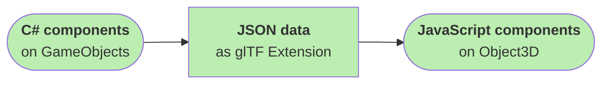

# Scripting 📑

Code for Needle Engine is written in TypeScript or JavaScript. We automatically generate C# stub components out of that, which you can add to GameObjects in the editor. The C# components and their data are recreated by the runtime as JavaScript components with the same data and attached to three.js objects.  



Both custom components as well as built-in Unity components can be mapped to JavaScript components in this way. For example, mappings for many built-in components related to animation, rendering or physics are already [included in Needle Engine](./component-reference.md#unity-components).  

----

Our JavaScript runtime API adopts a component model similar to the Unity Editor and provides a lot of similar functionality.  
JavaScript components attached to [three.js objects](https://threejs.org/docs/#api/en/core/Object3D) have lifecycle methods similar to Unity, like ``awake``, ``start``, ``onEnable``, ``onDisable``, ``update`` and ``lateUpdate``, that you can implement.   

> Learn more about the Unity event loop [here ⇡](https://docs.unity3d.com/Manual/ExecutionOrder.html) and which parts of that we currently support in the [section about Lifecycle Methods](#lifecycle-methods) below.  

To get an in-depth overview of built-in components, you can inspect the folder ``Packages/Needle Engine Exporter/Core/Runtime/Components`` in the [Project Window ⇡](https://docs.unity3d.com/Manual/ProjectView.html).  

> **Note**: Needle Engine's Exporter does _not_ compile your existing C# code to Web Assembly. While using Web Assembly may result in better performance at runtime, it comes at a high cost for iteration speed and flexibility in building web experiences. Read more about our [vision](./vision.md) and [technical overview](./technical-overview). 

## Contents 📋
- [Creating a new component](#creating-a-new-component)📋
- [Component architecture](#component-architecture)
- [Finding, adding and removing components](#finding-added-or-removing-components)
- [The Context and the DOM](#context-and-the-html-dom)
- [Accessing URL Parameters](#accessing-url-parameters)
- [Interop with external javascript](#accessing-components-from-external-javascript)
- [Automatically generating Unity components](#automatically-generating-unity-components-from-typescript-files)
- [Serialization in glTF files](#serialization--components-in-gltf-files)
- [AssetReference and Addressables](#assetreference-and-addressables)
- [Unity Types in Typescript](#renamed-unity-types-in-typescript)

---
## Creating a new component
Scripts are written in TypeScript (recommended) or JavaScript. There's two ways to add custom scripts to your project:

- Simply add a `.ts` or `.js` file inside `src/scripts/` in your generated project directory.  
  Generated C# components are placed under `Assets/Needle/GeneratedComponents`.  

- Organize your code into NPM Definition Files. These help you to modularize and re-use code between projects.  
  Generated C# components are placed in a `.codegen` folder next to the NpmDef.  
  You can create NpmDef files via `Create > Needle > NpmDef` and then add TypeScript files by right-clicking an NpmDef file and selecting `Create > Needle Engine > TypeScript`. Please see [this chapter](./project_structure.md#npm-definition-files) for more information.  

In both approaches, source directories are watched for changes and C# components are regenerated whenever a change is detected. Changes to the source files also result in a hot reload of the running website – you don't have to wait for Unity to recompile the C# components. This makes iterating on code pretty much instant.  

> **Tip**: You can have multiple components inside one file.

### Example Workflow

- **Create a component that rotates an object**  
  Create ``src/scripts/Rotate.ts`` and add the following code:  
```ts
import { Behaviour } from "needle.tiny.engine/engine-components/Component";

export class Rotate extends Behaviour
{
    start(){
        console.log(this);
    }

    update(){
        this.gameObject.rotateY(this.context.time.deltaTime);
    }
}
```

Now inside Unity create a new script inside your project named ``Rotate.cs``. Add the script to a Cube that is exported as part of a glTF file (it needs a ``GltfObject`` component in its parent) and save the scene. The cube is now rotating inside the browser.   
Open the chrome developer console to inspect the log from the ``Rotate.start`` method. This is a helpful practice to learn and debug what fields are exported and currently assigned. In general all public and non-public fields and all public properties are exported.  

Now add a new field ``public float speed = 5`` to your Unity component and save it. The Rotate component inspector now shows a ``speed`` field that you can edit. Save the scene (or click the ``Build`` button) and note that the javascript component now has the exported ``speed`` value assigned.  

> **Note**: It is also possible to ignore, convert or add fields on export in Unity by extending our export process. Documentation on that can be found in the [Export document](./export.md).

---
## Component architecture
Components are added to threejs [Object3Ds ⇡](https://threejs.org/docs/#api/en/core/Object3D) similar to how [components in Unity ⇡](https://docs.unity3d.com/ScriptReference/Component.html) are added to [GameObjects ⇡](https://docs.unity3d.com/ScriptReference/GameObject.html). Therefore when we want to access a three.js Object3D, we can access it as ``this.gameObject`` which returns our `Object3D`.  

***Note**: Setting ``visible`` to false on a Object3D will act like ``SetActive(false)`` in Unity - meaning it will also disable all the current components on this object and its children. Update events for inactive components are not being called until ``visible`` is set to true again.*

### Lifecycle methods

- ``awake`` - First method being called when a new component is created
- ``onEnable`` - Called when a component is enabled (e.g. when ``enabled`` changes from false to true)
- ``onDisable`` - Called when a component is disabled (e.g. when ``enabled`` changes from true to false)
- ``onDestroy`` - called when the Object3D or component is being destroyed
- ``start`` - Called on the start of the first frame after the component was created
- ``earlyUpdate`` - First mainloop update event
- ``update`` - Regular mainloop update event
- ``lateUpdate``
- ``onBeforeRender`` - Last update event before render call
- ``onAfterRender`` - Called after render event

> **Note**: It is important to understand that similar to Unity lifecycle methods are only being called when they are declared. So only declare `update` lifecycle methods when they are actually necessary, otherwise it may hurt performance if you have many components with update loops that do nothing.

### Coroutines

Coroutines can be declared using the [JavaScript Generator Syntax ⇡](https://developer.mozilla.org/en-US/docs/Web/JavaScript/Reference/Global_Objects/Generator).  
To start a coroutine, call ``this.startCoroutine(this.myRoutineName());``  

**Example**
```ts
export class Rotate extends Behaviour {

    start() {
        // the second argument is optional and allows you to specifiy 
        // when it should be called in the current frame loop
        // coroutine events are called after regular component events of the same name
        // e.g. Update coroutine events are called after component.update() functions
        this.startCoroutine(this.rotate(), FrameEvent.Update);
    }

    // this method is called every frame until it exits
    *rotate() {
        // keep looping forever
        while (true) {
            yield;
        }
    }
}
```

To stop a coroutine, either exit the routine by returning from it, or cache the return value of ``startCoroutine`` and call ``this.stopCoroutine(<...>)``.

## Finding, adding and removing components

To access other components, use the static methods on ``GameObject``. For example, to access a `Renderer` component in the parent use ``GameObject.getComponentInParent(this.gameObject, Renderer)``.  

**Example:**
```ts
import { Behaviour, GameObject } from "needle.tiny.engine/engine-components/Component";
import { Renderer } from "needle.tiny.engine/engine-components/Renderer";

export class MyComponent extends Behaviour {

    start() {
        const renderer = GameObject.getComponentInParent(this.gameObject, Renderer);
        console.log(renderer);
    }
}
```

### Some of the available methods:
- ``GameObject.instantiate(Object3D, InstantiateOptions)`` - creates a new instance of this object including new instances of all its components.
- ``GameObject.destroy(Object3D|Component)`` - destroy a component or Object3D (and its components)
- ``GameObject.addNewComponent(Object3D, Type)`` - adds (and creates) a new component for a type to the provided object. Note that ``awake`` and ``onEnable`` is already called when the component is returned.
- ``GameObject.addComponent(Object3D, Component)`` - moves a component instance to the provided object.
- ``GameObject.removeComponent(Component)`` - removes a component from a gameObject
- ``GameObject.getComponent(Object3D, Type)`` - returns the first component matching a type on the provided object.
- ``GameObject.getComponents(Object3D, Type)`` - returns all components matching a type on the provided object.
- ``GameObject.getComponentInChildren`` - same as ``getComponent`` but also searches in child objects.
- ``GameObject.getComponentsInChildren`` - same as ``getComponents`` but also searches in child objects.
- ``GameObject.getComponentInParent`` - same as ``getComponent`` but also searches in parent objects.
- ``GameObject.getComponentsInParent`` - same as ``getComponents`` but also searches in parent objects.
- ``GameObject.findObjectOfType`` - searches the whole scene for a type.
- ``GameObject.findObjectsOfType`` - searches the whole scene for all matching types.

## The Context and the HTML DOM

The context refers to the runtime inside a [web component ⇡](https://developer.mozilla.org/en-US/docs/Web/Web_Components).  
The three.js scene lives inside a custom HTML component called ``<needle-engine>`` (see the *index.html* in your project). You can access that element using ``this.context.domElement``.   

This architecture allows for potentially having multiple needle WebGL scenes on the same webpage, that can either run on their own or communicate between each other as parts of your webpage.  

> **Note**: The exporter currently only supports exporting one scene for one html element, but you can create HTML files with multiple contexts. We might make this easier in the future. 

### Three.js Scene
Access the three.js [scene](https://threejs.org/docs/#api/en/scenes/Scene) using ``this.context.scene``.

### Time
Use ``this.context.time`` to access ``time``, ``frameCount`` or ``deltaTime`` (time since last frame in milliseconds).  

### Input
Use ``this.context.input`` to access convenient methods for getting mouse and touch data. WebXR controller access is currently separate.  

### Physics
Use ``this.context.physics`` to access the physics API, for example to perform raycasts against scene geometry.  

> **Note**: [Layers ⇡](https://docs.unity3d.com/Manual/Layers.html) are mapped from Unity to three.js [Layers ⇡](https://threejs.org/docs/#api/en/core/Layers). By default, physics will ignore objects on layer 2 (this is the ``Ignore Raycast`` layer in Unity) but hit all other layers. We recommended setting up your layers as needed in Unity, but if you need, you can override this behaviour using the `options` parameter that you can pass to the ``physics.raycast`` method. 

### Networking
Networking methods can be accessed via ``this.context.connection``. Please refer to the [networking docs](./networking.md) for further information.

### Assets
Use ``this.context.assets`` to get access to assets and resources that are imported inside glTF files.

## Accessing URL Parameters
Use `utils.getParam(<..>)` to quickly access URL parameters and define behaviour with them.

**Example:**
```ts
import { Behaviour } from "needle.tiny.engine/engine-components/Component";
import * as utils from "needle.tiny.engine/engine/engine_utils"

export class MyScript extends Behaviour
{ 
    awake(): void {
        // access the url parameter
        const urlParam = utils.getParam("target");
        if (urlParam && typeof urlParam === "string" && urlParam.length > 0) {
            // const do something based on ?target=some_string
        }
    }
}
```

## Accessing components from external JavaScript
It is possible to access all the functionality described above using regular JavaScript code that is not inside components and lives somewhere else. For that just find the ``<needle-tiny>`` web-component in your DOM and retrieve the ``Context`` from it e.g. by calling ``document.getElementById("tiny")?.context``.  

The web-component also exposes a reference to the static ``GameObject`` functions described above. You can find components using ``document.getElementById("tiny")?.gameObject.findObjectOfType("AudioSource")`` for example. It is recommended to cache those references, as searching the whole scene repeatedly is expensive.

## Automatically generating Unity components from typescript files
*Experimental feature to automatically generate Unity components for typescript component in your project - installation and setup might change*  
- Install [``@needle-tools/needle-component-compiler`` ⇡](https://www.npmjs.com/package/@needle-tools/needle-component-compiler) in your project (it comes pre-installed using our template projects)
- In Unity add a ``Component Generator`` component to the GameObject with your ``ExportInfo`` component. when installed to the project the component will automatically fill-out the correct path. 
- Now when adding new components in ``threejs/project/src/scripts`` or any of your npmdefs it will automatically generate Unity scripts in ``Assets/Needle/GeneratedComponents`` or the respective npmdef codegen directory.

### Controlling component generation
You can use the following typescript attributes to control C# code generation behavior:  
| Attribute | Result |
| -- | -- |
| `// @generate-component` | Force generation of next class|
| `// @dont-generate-component` | Disable generation of next class |
| `// @serializeField` | Decorate generated field with `[SerializeField]` |
| `// @type(UnityEngine.Camera)` | Specify generated C# field type |

The attribute `@dont-generate-component` is especially useful if you have an existing Unity script you want to match, or when you want to extend the generated code with custom logic (e.g. Gizmo drawing). You'll have to ensure yourself that the serialized fields match in this case – only matching fields/properties will be exported.

### Extending generated components
Component C# classes are generated with the [`partial ⇡`](https://docs.microsoft.com/en-us/dotnet/csharp/programming-guide/classes-and-structs/partial-classes-and-methods) flag so that it is easy to extend them with functionality. This is helpful to draw gizmos, add context menus or add additional fields or methods that are not part of a built-in component.  

### Version Control
While generated C# components use the type name to produce stable GUIDs, we recommend checking in generated components in version control as a good practice.  

## Serialization / Components in glTF files
To embed components and recreate components with their correct types in glTF, we also need to save non-primitive types (everything that is not a ``Number``, ``Boolean`` or ``String``). You can do so is adding a ``@serializeable(<type>)`` decorator above your field or property. 

**Example:**
```js
export class MyClass extends Behaviour {
    @serializeable(Object3D) // this will be a "Transform" field in Unity
    myObjectReference: THREE.Object3D | null = null;
} 
``` 

To serialize from and to custom formats, it is possible to extend from the ``TypeSerializer`` class and create an instance. Use ``super()`` in the constructor to register supported types.  

> **Note**: In addition to matching fields, matching properties will also be exported when they match to fields in the typescript file. 

## AssetReference and Addressables
Referenced Prefabs, SceneAssets and [``AssetReferences`` ⇡](https://docs.unity3d.com/Packages/com.unity.addressables@latest/manual/AddressableAssetsGettingStarted.html) in Unity will automatically be exported as glTF files (please refer to the [Export Prefabs](export.md#gltf-prefabs) documentation).  

These exported gltf files will be serialized as plain string URIs. To simplify loading these from TypeScript components, we added the concept of ``AssetReference`` types. They can be loaded at runtime and thus allow to defer loading parts of your app or loading external content.

**Example:**
```ts
    @serializeable(AssetReference)
    myPrefab?: AssetReference;
    
    start() {
      // load only, instantiate later
      await myPrefab?.loadAssetAsync();
      // or directly instantiate
      await myPrefab?.instantiate();
    }  
```

AssetReferences are cached by URI, so if you reference the same exported glTF/Prefab in multiple components/scripts it will only be loaded once and then re-used.  

## Renamed Unity Types in TypeScript
For future compatibility, some Unity-specific types are mapped to different type names in our engine.  

| Unity Type | Type in Needle Engine |
| -- | -- |
| ``UnityEvent`` | ``EventList`` |
