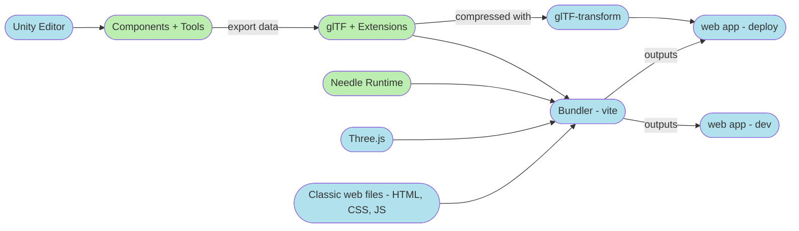

# Technical Overview

## How it works

Needle Engine roughly consists of three parts:
- a number of **components and tools** that allow you to set up scenes for Needle Engine from e.g. the Unity Editor.  
- an **exporter** that turns scene and component data into glTF.
- a **web runtime** that loads and runs the produced glTF files and their extensions.

The editor extensions currently support the Unity Editor, with some promising experiments for Blender on the horizon (but no ETA).  
The web runtime uses three.js for rendering, adds a component system on top of the three scene graph and hooks up extension loaders for our custom glTF extensions.  

Effectively, this turns the Unity Editor into a full member of a regular web development toolchain – "just" one more piece that gets added to the regular HTML, JavaScript, CSS and bundling workflow.  



## glTF Assets

Models, textures, animations, lights, cameras and more are stored as [glTF 2.0 files ⇡](https://registry.khronos.org/glTF/specs/2.0/glTF-2.0.html) in Needle Engine.  
Custom data is stored in [vendor extensions ⇡](#vendor-specific-gltf-extensions-needle_). These cover everything from interactive components to physics, sequencing and lightmaps.  

### Supported glTF extensions

A typical production glTF created by Needle Engine uses the following extensions:  
```
KHR_lights_punctual
KHR_materials_unlit
KHR_texture_transform
KHR_animation_pointer
NEEDLE_techniques_webgl
NEEDLE_gameobject_data
NEEDLE_components
NEEDLE_persistent_assets
NEEDLE_lightmaps
NEEDLE_lighting_settings
KHR_texture_basisu
KHR_draco_mesh_compression
```

Other supported extensions:
```
EXT_meshopt_compression
EXT_mesh_gpu_instancing (import and export)
```

Supported material extensions:  

```
KHR_materials_clearcoat
KHR_materials_ior
KHR_materials_specular
KHR_materials_transmission
KHR_materials_iridescence
KHR_materials_unlit
KHR_materials_volume
```

> **Note**: Materials using these extensions can be exported from Unity via UnityGLTF's `PBRGraph` material.  

> **Note**: Audio and variants are already supported in Needle Engine through `NEEDLE_components` and `NEEDLE_persistent_assets`, but there are some options for more alignment to existing proposals such as `KHR_audio` and `KHR_materials_variants`.

[Learn more about GLTF loading in three.js ⇡](https://threejs.org/docs/#examples/en/loaders/GLTFLoader)

### Compression

For production, we compress glTF assets with [`glTF-transform` ⇡](https://gltf-transform.donmccurdy.com/). Textures use either `etc1s`, `uastc` or no compression, depending on texture type. Meshes use `draco`. Custom extensions are passed through in an opaque way.  

> **Note**: We might switch to meshopt compression in the future, but there's a number of open issues in three.js related to raycasts and bounds for meshopt-compressed assets.  

## Vendor-specific glTF Extensions (NEEDLE_*)

Needle Engine stores custom data in glTF files through our vendor extensions. These extensions are designed to be flexible and allow relatively arbitrary data to put into them. Notably, no code is stored in these files. Interactive components is restored from the data at runtime. This has some similarities to how AssetBundles function in Unity – the receiving side of an asset needs to have matching code for components stored in the file.  

> We're currently not prodiving schemas for these extensions as they are still in development. The JSON snippets below demonstrates extension usage by example and includes notes on architectural choices and what we may change in future releases.  

> References between pieces of data are currently constructed through a mix of indices into other parts of the glTF file and JSON pointers. We may consolidate these approaches in a future release. We're also storing string-based GUIDs for cases where ordering is otherwise hard to resolve (e.g. two components referencing each other) that we may remove in the future.  

### NEEDLE_components

This extension contains per-node component data. The component names map to type names on both the JavaScript and C# side.  
Multiple components with the same name can be added to the same node.  

Data in `NEEDLE_components` can be animated via the currently not ratified [`KHR_animation_pointer` ⇡](https://github.com/ux3d/glTF/tree/extensions/KHR_animation_pointer/extensions/2.0/Khronos/KHR_animation_pointer) extension.  

```json
"NEEDLE_components": {
  "builtin_components": [
    {
      "name": "WebARSessionRoot",
      "guid": "1516450550",
      "arScale": 50,
      "invertForward": true,
      "enabled": true,
      "gameObject": {
        "node": 0
      }
    },
    {
      "name": "SyncedRoom",
      "guid": "1516450552",
      "roomName": "network-room",
      "urlParameterName": "room",
      "joinRandomRoom": true,
      "requireRoomParameter": false,
      "autoRejoin": true,
      "enabled": true,
      "gameObject": {
        "node": 0
      }
    },
    {
      "name": "PlayableDirector",
      "guid": "2243275882009986562_1668529989451832962",
      "state": 0,
      "extrapolationMode": 1,
      "playableAsset": "extensions/NEEDLE_persistent_assets/4",
      "playableGraph": {},
      "playOnAwake": true,
      "timeUpdateMode": 0,
      "time": 0,
      "initialTime": 0,
      "duration": 135.383333333332,
      "enabled": true,
      "gameObject": {
        "node": 0
      }
    }
  ]
}
```

> **Note**: Storing only the component type name means that type names currently need to be unique per project. We're planning to include package names in a future release to loosen this constraint to unique component type names per package instead of globally.  

> **Note**: Currently there's no versioning information in the extension (which npm packaage does a component belong to, which version of that package was it exported against). We're planning to include versioning information in a future release.  

> **Note**: Currently all components are in the `builtin_components` array. We might rename this to just `components` in a future release.  

### NEEDLE_gameobject_data

This extension contains additional per-node data related to state, layers, and tags. Layers are used for both rendering and physics, similar to how [three.js ⇡](https://threejs.org/docs/#api/en/core/Layers) and [Unity ⇡](https://docs.unity3d.com/Manual/Layers.html) treat them.  

```json
"NEEDLE_gameobject_data": {
  "layers": 0,
  "tag": "Untagged",
  "hideFlags": 0,
  "static": false,
  "activeSelf": true,
  "guid": "1516450549"
}
```

> **Note**: We may need to better explain why this is not another entry in [`NEEDLE_components`](#needle_components). 

### NEEDLE_lighting_settings

This is a root extension defining ambient lighting properties per glTF file.   

```json
"NEEDLE_lighting_settings": {
  "ambientMode": 0,
  "ambientLight": [
    0.212,
    0.227,
    0.259,
    1
  ],
  "ambientIntensity": 1,
  "defaultReflectionMode": 0
}
```

> **Note**: This extension might have to be defined per-scene instead of per-file.

### NEEDLE_lightmaps

This is a root extension defining a set of lightmaps for the glTF file.

```json
"NEEDLE_lightmaps": {
  "textures": [
    {
      "pointer": "textures/20",
      "type": 1,
      "index": 0
    }
  ]
}
```

> **Note**: At the moment this extension also contains environment texture references. We're planning to change that in a future release. 

| Texture Type | Value |
| -- | -- |
| Lightmap | 0 |
| Environment Map  | 1 |
| Reflection Map | 2 |

How lightmaps are applied is defined in the `MeshRenderer` component inside the [`NEEDLE_components`](#needle_components) extension per node:  

```json
"NEEDLE_components": {
  "builtin_components": [
    {
      "name": "MeshRenderer",
      ...
      "lightmapIndex": 0,
      "lightmapScaleOffset": {
        "x": 1.00579774,
        "y": 1.00579774,
        "z": -0.00392889744,
        "w": -0.00392889744
      },
      ...
    }
  ]
}
```

> **Note**: We may change that in a future release and move lightmap-related data to a `NEEDLE_lightmap` extension entry per node. 

### NEEDLE_persistent_assets

Components in `NEEDLE_components` can reference data via JSON Pointers. The data in `NEEDLE_persistent_assets` is often referenced multiple times by different components and is thus stored separately in a root extension. By design, they are always referenced by something else (or have references within each other), and thus do not store type information at all: they're simply pieces of JSON data and components referencing them currently need to know what they expect. 

Examples for assets/data stored in here are:  
- AnimatorControllers, their layers and states
- PlayableAssets (timelines), their tracks and embedded clips
- SignalAssets
- ...

Data in `persistent_assets` can reference other `persistent_assets` via JSON Pointer, but by design can't reference `NEEDLE_components`. This is similar to the separation beween "Scene data" and "AssetDatabase content" in Unity. 

```json
{
  "name": "LampionController",
  "guid": "9100000_ecab75bc7ab51a747a4c5c14236a43cd",
  "parameters": [],
  "layers": [
    {
      "name": "Base Layer",
      "stateMachine": {
        "name": "Base Layer",
        "defaultState": 0,
        "states": [
          {
            "name": "LampionFlying",
            "hash": 677739540,
            "motion": {
              "name": "LampionFlying",
              "isLooping": false,
              "guid": "7400000_c296c4d76e956b34f8b5833ba90653c1",
              "clips": [
                {
                  "node": "nodes/4",
                  "clip": "animations/0"
                },
                {
                  "node": "nodes/9",
                  "clip": "animations/6"
                },
                {
                  "node": "nodes/14",
                  "clip": "animations/12"
                }
              ]
            },
            "transitions": [
              {
                "isExit": false,
                "exitTime": 1,
                "hasFixedDuration": true,
                "offset": 0,
                "duration": 0,
                "hasExitTime": true,
                "destinationState": 0,
                "conditions": []
              }
            ]
          }
        ],
        "entryTransitions": []
      }
    }
  ]
},
{
  "name": "TrongCom Website",
  "guid": "11400000_93a8f856fe26af8498d94efe4835af36",
  "tracks": [
    {
      "name": "Markers",
      "type": "MarkerTrack",
      "muted": false,
      "outputs": [
        null
      ],
      "clips": [],
      "markers": [],
      "trackOffset": null
    },
    {
      "name": "Animation Track",
      "type": "AnimationTrack",
      "muted": false,
      "outputs": [
        "5017454109690854928_1668529989451832962"
      ],
      "clips": [
        {
          "start": 0,
          "end": 0.9833333333333333,
          "duration": 0.9833333333333333,
          "timeScale": 1,
          "asset": {
            "clip": "animations/78",
            "loop": false,
            "duration": 8,
            "position": {
              "x": 0,
              "y": 0,
              "z": 0
            },
            "rotation": {
              "x": 0,
              "y": 0,
              "z": 0,
              "w": 1
            },
            "removeStartOffset": true
          },
          "clipIn": 0,
          "easeInDuration": 0,
          "easeOutDuration": 0.41666666666666663,
          "preExtrapolationMode": 1,
          "postExtrapolationMode": 1
        },
        ... 
      ]
    }
  ]
}
```

> **Note**: We might include more type and versioning information in the future. 

### NEEDLE_techniques_webgl

This extension builds upon the archived [`KHR_techniques_webgl` ⇡](https://github.com/KhronosGroup/glTF/tree/main/extensions/2.0/Archived/KHR_techniques_webgl) extension and extends it in a few crucial places. While the original extension was specified against WebGL 1.0, we're using it with WebGL 2.0 here and have added a number of  uniform types.  

```json
"KHR_techniques_webgl": {
  "programs": [
    {
      "vertexShader": 1,
      "fragmentShader": 0,
      "id": 0
    }
  ],
  "shaders": [
    {
      "name": "Pass-FRAGMENT",
      "type": 35632,
      "uri": "<embedded WebGL fragment shader code ...>",
      "id": 1
    },
    {
      "name": "Pass-VERTEX",
      "type": 35633,
      "uri": "<embedded WebGL vertex shader code ...>",
      "id": 0
    }
  ],
  "techniques": [
    {
      "program": 0,
      "attributes": {},
      "uniforms": {
        "_TimeParameters": {
          "name": "_TimeParameters",
          "type": 35666,
          "semantic": null,
          "count": 1,
          "node": 0
        },
        "hlslcc_mtx4x4unity_MatrixVP": {
          "name": "hlslcc_mtx4x4unity_MatrixVP",
          "type": 35666,
          "semantic": "_VIEWPROJECTION",
          "count": 4,
          "node": 0
        }
      },
      "defines": []
    }
  ]
}     
```

> **Note**: Currently, vertex and fragment shaders are always embedded as URI; we plan on moving that data into more reasonable bufferViews in the future.  

> **Note**: There's some redundant properties in here that we plan on cleaning up.  

## TypeScript and Data Mapping

> 🏗️ Under Construction

## Rendering with three.js

> 🏗️ Under Construction
